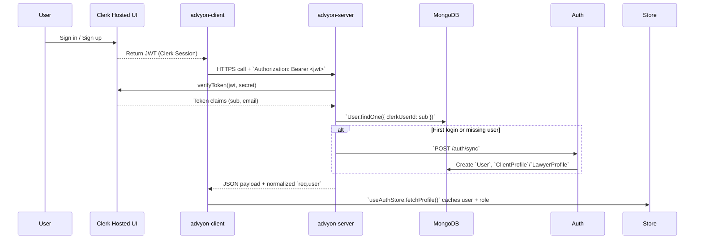
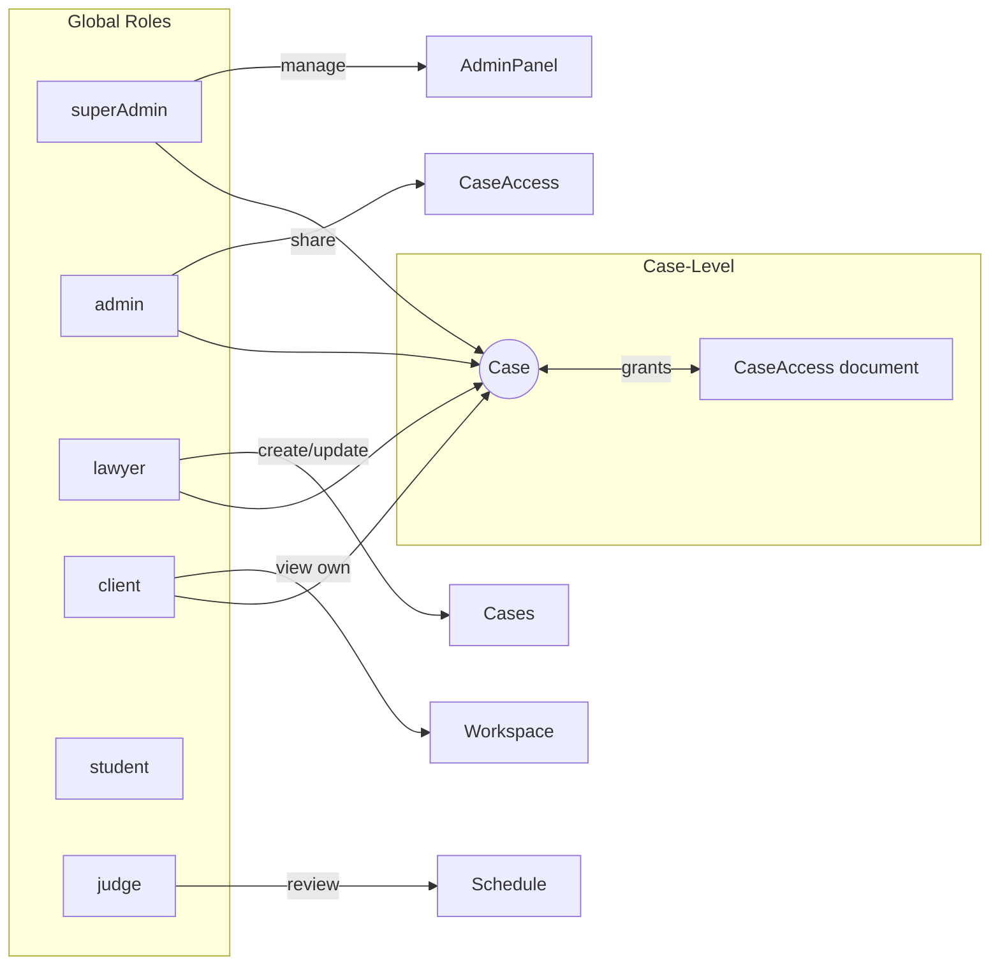

# Authentication & Authorization Flow

## Identity Providers & Session Lifecycle

- All protected REST endpoints wrap `auth()` middleware; optional role arguments enforce server-side RBAC even if the UI hides links.
- Clerk remains the source of truth for password resets & MFA; Advyon stores only hashed optional passwords for legacy flows.

> Source: advyon-server/src/app/middlewares/auth.ts (c73ac5a)
> Source: advyon-server/src/app/modules/auth/auth.route.ts (c73ac5a)
> Source: advyon-client/src/store/useAuthStore.js (c73ac5a)

## Express Auth Pipeline
1. `auth.ts` extracts and verifies the Clerk JWT using `@clerk/clerk-sdk-node.verifyToken` plus issuer whitelisting.
2. If the Mongo user is missing, `/auth/sync` auto-runs `AuthServices.syncUserFromClerk`, creating a record that mirrors Clerk claims.
3. Soft-deleted users are blocked on every route except `/auth/sync`, where re-registration resets status to `active`.
4. Role-specific guards (`auth('admin','superAdmin')`) short-circuit before hitting controllers, ensuring defense-in-depth with the client-side `<RequireRole />` wrapper.
5. `req.user` is populated with `clerkUserId`, `email`, Advyon `id`, and `role`, and downstream controllers rely on it for auditing.

> Source: advyon-server/src/app/middlewares/auth.ts (c73ac5a)
> Source: advyon-client/src/components/auth/RequireRole.jsx (c73ac5a)

## Case-Level Authorization & Delegation
- **Route gating**: modules such as Case Access, Payments, and Analytics explicitly enumerate role lists.
- **Case sharing** uses the `CaseAccess` API: only `admin`, `superAdmin`, and `lawyer` roles may call `/case-access/share`, `/case-access/:caseId/users`, and `/case-access/:caseId/:userId` to add/remove collaborators.
- **Per-request scoping**: controllers fetch the requesting user via `req.user` and, when needed, ensure they have matching `CaseAccess` rows (e.g., case activities, document downloads).



> Source: advyon-server/src/app/modules/caseAccess/caseAccess.route.ts (c73ac5a)
> Source: advyon-server/src/app/modules/case/case.route.ts (c73ac5a)

## Session Propagation to Realtime Channels
- Socket.io connections call `socket.handshake.auth.token`, run the *same* Clerk verification, and attach `userId`/`userRole` to the socket instance.
- Rooms follow the convention `user:<AdvyonId>` (direct notifications), `case:<caseId>` (shared dashboards), and `chat:<conversationId>`.
- Online presence emits `user:online` / `user:offline`; sidebar counters rely on the `SIDEBAR_UPDATE` event triggered after new messages or AI analysis completes.

```mermaid
flowchart LR
    ClientSocket -- token --> Gateway
    Gateway -->|verifyToken| Clerk
    Clerk --> Gateway
    Gateway -->|findOne({clerkUserId})| MongoUser
    MongoUser --> Gateway
    Gateway -->|join user:ID| SocketRooms
    Gateway -->|emit case:CASEID| Subscribers
```

> Source: advyon-server/src/app/modules/socket/socket.service.ts (c73ac5a)

## Frontend Guards & UX Hooks
- `<RequireRole allowedRoles={['lawyer','admin']}>` wraps sensitive routes like `/dashboard/clients` and `/dashboard/analytics`.
- Zustand stores (`useAuthStore`, `useCasesStore`, `useDocumentsStore`) consume `/users/me/**` endpoints immediately after Clerk `SignedIn` events to keep client cache aligned with server decisions.
- When `useAuthStore.user` is `null`, router falls back to `/auth/signin` and preserves the originating location via `state.from`.

> Source: advyon-client/src/routes/index.jsx (c73ac5a)
> Source: advyon-client/src/store/useAuthStore.js (c73ac5a)
> Source: advyon-client/src/store/cases.js (c73ac5a)

