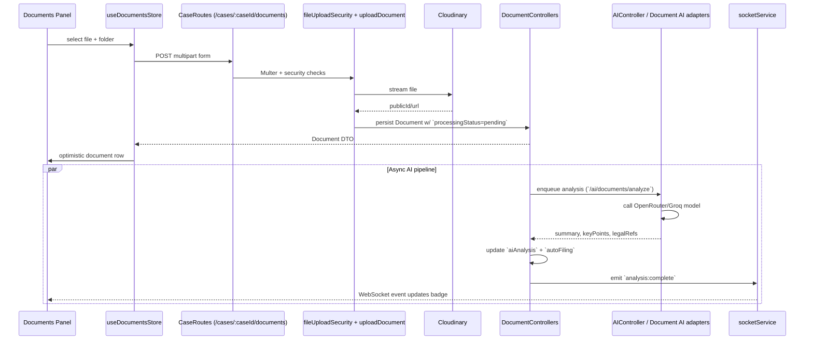
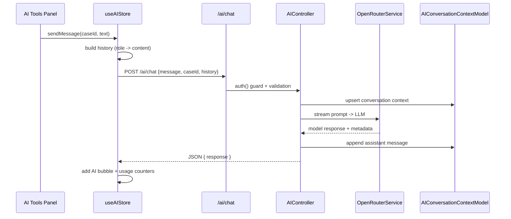

# Data Flow & Integration Diagrams

## L0 Context Diagram
```mermaid
graph TB
    subgraph External Actors
        Admin
        Lawyer
        Client
        CommunityMember
    end

    subgraph Client Layer
        Browser[advyon-client (React + Vite)]
        Mobile[Future mobile shell]
    end

    subgraph Platform Core
        API[advyon-server (Express + Socket.io)]
        DB[(MongoDB Atlas)]
    end

    subgraph Services
        Clerk[Clerk Auth]
        Stripe[Stripe Billing]
        Cloudinary[Cloudinary Storage]
        AIHub[Gemini / Groq / OpenRouter]
    end

    Admin --> Browser
    Lawyer --> Browser
    Client --> Browser
    CommunityMember --> Browser

    Browser -->|REST/WS| API
    API -->|CRUD| DB
    API -->|JWT verify| Clerk
    API -->|checkout/webhooks| Stripe
    API -->|upload -> URL| Cloudinary
    API -->|prompts| AIHub
    Browser <-->|socketService| API
```

## L1: Case Intake & Workspace Flow
```mermaid
flowchart LR
    subgraph Dashboard
        WorkspaceUI[WorkspacePage.jsx]
        CasesStore[useCasesStore]
    end

    subgraph Backend
        CaseRoute[/POST /cases/]
        CaseService[case.service.ts]
        ActivityModel[(Activity)]
    end

    WorkspaceUI -->|dispatch createCase| CasesStore
    CasesStore -->|api.post /cases| CaseRoute
    CaseRoute -->|auth()+validate| CaseService
    CaseService -->|Case.create| MongoCases[(Case)]
    CaseService -->|log| ActivityModel
    MongoCases -->|response| CaseService
    CaseService --> CaseRoute --> CasesStore --> WorkspaceUI
    ActivityModel --> socketService --> WorkspaceUI
```
- `useCasesStore` handles optimistic updates, caching, and archive workflows before hitting `/cases/:caseId/archive`.
- Activity feed subscribes to Socket.io events triggered whenever `CaseService` logs `case_created`, keeping dashboards real-time.

> Source: advyon-client/src/pages/WorkspacePage.jsx (c73ac5a)
> Source: advyon-client/src/store/cases.js (c73ac5a)
> Source: advyon-server/src/app/modules/case/case.route.ts (c73ac5a)
> Source: advyon-server/src/app/modules/activity/activity.model.ts (c73ac5a)

## L1: Document Automation & AI Analysis

- Document schema tracks `autoFiling.status`, `aiAnalysis.documentCategory`, and `processingStatus` so both dashboards and schedulers know when AI finished.
- Frontend polls `/cases/:caseId/documents/:documentId/status` for fallback in case sockets are unreachable.

> Source: advyon-client/src/store/documents.js (c73ac5a)
> Source: advyon-server/src/app/modules/document/document.route.ts (c73ac5a)
> Source: advyon-server/src/app/middlewares/fileUploadSecurity.ts (c73ac5a)
> Source: advyon-server/src/app/modules/ai/ai.route.ts (c73ac5a)
> Source: advyon-server/src/app/modules/socket/socket.service.ts (c73ac5a)

## L1: AI Legal Assistant Conversations

- Additional endpoints (`/ai/tools/:toolKey/run`, `/ai/tools/history`, `/ai/tools/metrics`) feed dashboards and audit logs consumed by `useAIStore.fetchToolHistory`.
- LLM provider selection lives in `openrouter.service.ts`, while personalization hints come from `AIPersonalizationProfile`.

> Source: advyon-client/src/store/useAIStore.js (c73ac5a)
> Source: advyon-server/src/app/modules/ai/ai.route.ts (c73ac5a)
> Source: advyon-server/src/app/modules/ai/openrouter.service.ts (c73ac5a)
> Source: advyon-server/src/app/modules/ai/ai.context.model.ts (c73ac5a)

## L1: Analytics, Community & Support Ingestion
- **Community Hub**
  - `CommunityHubPage` relies on `useCommunityStore.fetchThreads()` which queries `/community/threads` with optional filters and caches results for 30 seconds.
  - Posting a question triggers sanitization + moderation gating before hitting `Thread` + `CommunityEngagementEventModel`. Gamification points update user scores and send sidebar WebSocket updates when thresholds change.
- **Support & Contact**
  - Marketing site contact forms post to `/contact`, persisting into `ContactTicket` with attachments and metadata. Daily cron aggregates into `SupportTicketMetric` for analytics charts.
- **Metadata & Insights**
  - Legal search uses `/legal` and `/legal/:id`, populating `useLegalStore` for knowledge management features.

> Source: advyon-client/src/store/useCommunityStore.js (c73ac5a)
> Source: advyon-server/src/app/modules/community/community.service.ts (c73ac5a)
> Source: advyon-server/src/app/modules/gamification/gamification.service.ts (c73ac5a)
> Source: advyon-server/src/app/modules/contact/contact.model.ts (c73ac5a)
> Source: advyon-server/src/app/modules/analytics/support-ticket-metric.model.ts (c73ac5a)
> Source: advyon-client/src/store/legal.js (c73ac5a)

## Integration Touchpoints Checklist
| Integration | Direction | Trigger | Notes |
|-------------|-----------|---------|-------|
| Clerk Webhooks (optional) | Clerk -> Backend | future `user.deleted` handlers | currently rely on runtime sync; plan to add webhook handler when enabling orgs |
| Stripe Webhooks | Stripe -> `/payments/webhook` | Payment success, subscription changes | Endpoint uses `express.raw` and `handleStripeWebhook` to validate signatures before updating `Subscription` + `Payment` |
| Cloudinary | Backend -> Cloudinary | Document uploads | Credentials read from `.env`; file sanitizer removes risky extensions |
| AI Providers | Backend -> OpenRouter/Groq/Gemini | `/ai/chat`, `/ai/tools/**`, community moderation | All keys loaded via `openrouter.config.ts`, `groq.config.ts`, `gemini.config.ts` |

> Source: advyon-server/src/app/modules/payment/payment.route.ts (c73ac5a)
> Source: advyon-server/src/app/config/cloudinary.config.ts (c73ac5a)
> Source: advyon-server/src/app/modules/ai/ai.service.ts (c73ac5a)

