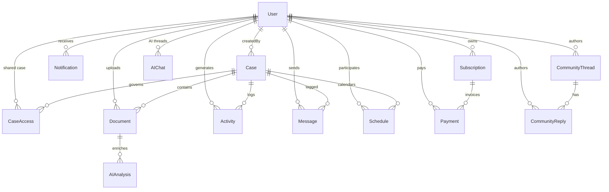

# Database Schema & Storage Architecture

## Platform Overview
- Primary datastore: **MongoDB Atlas** accessed through Mongoose models under `advyon-server/src/app/modules/**`. Connection pooling (maxPoolSize 10) and retry/backoff are configured in `src/server.ts`, so API and WebSocket traffic reuse a single connection per process.
- Collections follow a **feature-first naming convention** (`User`, `Case`, `Document`, etc.) and lean on application-level soft deletes plus compound indexes for multi-tenant filtering.
- Time-series style data (activities, analytics, engagement) uses timestamped documents with descending indexes to keep dashboards snappy.

## Entity Relationship Snapshot

## Core Identity & Profiles
| Collection | Purpose | Key Fields | Indexing Highlights |
|------------|---------|------------|---------------------|
| `User` | Canonical identity with Clerk linkage, preferences, and gamification points | `id`, `clerkUserId`, `role` (`superAdmin`, `admin`, `lawyer`, `client`, `judge`, `student`), `preferences.theme/notifications`, `points`, `weeklyPoints`, `lastWeekReset` | Unique indexes on `id`, `email`, `clerkUserId`; compound `(role,status)` and `(createdAt,isDeleted)` keep admin filters fast |
| `Role` + `UserRole` | Custom role catalog + user-role assignments for future expansion | `code`, `name`, `description`; `userId`, `roleId`, `isPrimary` | Unique `code`, `id`; timestamps on assignments |
| `Profile` trio | Domain-specific profile data per persona | Client: `phoneNumber`, `address`; Lawyer: `barRegistrationNumber`, `yearsOfExperience`, `verificationStatus`; Judge: `courtName`, `designation` | Unique `userId` per profile to guard duplicates |
| `Personalization` | Stores dashboard layout, behavior log (capped at 500), notification channel prefs, frequently accessed documents | Array trimming on save prevents unbounded growth; TTL-like logic for histories |

> Source: advyon-server/src/app/modules/user/user.model.ts (c73ac5a)
> Source: advyon-server/src/app/modules/user/profile.model.ts (c73ac5a)
> Source: advyon-server/src/app/modules/user/personalization.model.ts (c73ac5a)
> Source: advyon-server/src/app/modules/user/role.model.ts (c73ac5a)
> Source: advyon-server/src/app/modules/user/user-role.model.ts (c73ac5a)

## Case Management Backbone
| Collection | Purpose | Key Fields | Notable Rules |
|------------|---------|------------|---------------|
| `Case` | Master record for each matter | `id`, `caseNumber`, `caseType`, `status` (`active`, `archived`, etc.), `urgency`, `progress`, optional `clientId` | Pre `find` hooks strip `isDeleted` cases, archive metadata fields track lifecycle |
| `CaseAccess` | Granular sharing semantics | `caseId`, `userId`, `grantedBy`, `role` (`viewer`/`editor`/`admin`), `expiresAt`, `status` | Unique `(caseId,userId)` enforces single share row per user |
| `Document` | File metadata + AI enrichment | `id`, `folderName`, Cloudinary refs, `processingStatus`, `autoFiling.status`, nested `aiAnalysis.summary/keyPoints/extractedEntities`, `analysisStatus` | Indexes on `caseId`, `folderName`, `uploadedBy`, `processingStatus`, `aiAnalysis.documentCategory`; sanitised uploads enforced upstream |
| `Activity` | Audit trail for dashboards | `type` (`case_created`, `document_uploaded`, ...), `message`, `userId`, optional `caseId/documentId`, free-form `metadata` map | Descending `createdAt` + per user/case indexes |
| `Schedule` | Hearings, filings, meetings w/ recurrence | `eventType`, `date`, `startTime`, `status`, `participants`, `recurrence`, `reminders` | Indexes on `caseId`, `participants`, `recurrence.frequency`, `resourceId` |

> Source: advyon-server/src/app/modules/case/case.model.ts (c73ac5a)
> Source: advyon-server/src/app/modules/caseAccess/caseAccess.model.ts (c73ac5a)
> Source: advyon-server/src/app/modules/document/document.model.ts (c73ac5a)
> Source: advyon-server/src/app/modules/activity/activity.model.ts (c73ac5a)
> Source: advyon-server/src/app/modules/schedule/schedule.model.ts (c73ac5a)

## Communication, Community & Real-Time Data
| Collection | Purpose | Key Fields | Notes |
|------------|---------|------------|-------|
| `Message` | Structured inbox with attachments and read receipts | `senderId`, `receiverId`, `caseId`, `threadId`, `status`, `priority`, `attachments[]`, `readReceipts[]` | Text index (`subject`, `content`) powers search; optimistic updates in `useMessageStore` consume these APIs |
| `Notification` | Multi-channel alerts | `type`, `priority`, `recipientId`, optional `caseId`, `channels.inApp/email/webPush`, `idempotencyKey` | Descending timestamp + `(recipientId,isRead)` index for batch updates |
| `Conversation` + `ChatMessage` | Socket-powered 1:1 chat | Conversation keeps `participants[2]`, `lastMessageAt`, per-user `unreadCounts`; message docs include `status`, `readAt` | Engineered for Socket.io rooms (`chat:<conversationId>`) described in `socket.service.ts` |
| `Thread` + `Reply` | Community hub with AI moderation snapshots | Title/content sanitized, `category`, `tags`, `moderation.status/confidence`, `views`, `upvotes/downvotes`, `repliesCount`, `isSolved`; replies record `isAcceptedAnswer` | Aggregations feed trending topics & KPI tracking; moderation snapshots store OpenRouter toxicity scores |
| `ModerationReview` + `ModerationAppeal` | Tracks flagged content workflow | `targetType`, `decision`, `confidence`, reviewer metadata; appeals capture `reason`, `status`, resolution notes |
| `CommunityEngagementEvent` | Append-only analytics of community usage | `eventType` (thread_create, reply_vote, etc.), `metadata`, `threadId/replyId` | Used by dashboards + moderation heuristics |

> Source: advyon-server/src/app/modules/message/message.model.ts (c73ac5a)
> Source: advyon-server/src/app/modules/notification/notification.model.ts (c73ac5a)
> Source: advyon-server/src/app/modules/chat/chat.model.ts (c73ac5a)
> Source: advyon-server/src/app/modules/community/community.model.ts (c73ac5a)
> Source: advyon-server/src/app/modules/community/community.moderation.model.ts (c73ac5a)
> Source: advyon-server/src/app/modules/community/community.kpi.model.ts (c73ac5a)

## AI, Analytics & Automation
| Collection | Purpose | Highlights |
|------------|---------|------------|
| `AIChat` | Persistent AI chat history per user | Stores `messages[] {role, content, timestamp}` and arbitrary `context` blob for follow-up prompts |
| `AIConversationContext` & `AIPersonalizationProfile` | Keeps lightweight prompt history + tone preferences per user/case pair | Unique `(userId,caseId)` ensures one context doc per thread; personalization logs usage counts & keywords |
| `AIToolHistory` | Audit of AI tool executions | `toolKey`, `input`, `output`, `status`, `latencyMs`, `metadata.caseId/documentIds` enable rate limiting + reporting |
| `SupportTicketMetric` | Daily rollups for support analytics | `date`, `countsByUrgency/topic/source` stored as Mongo maps |
| `ContactTicket` | Public contact form submissions (marketing site) | `referenceId`, `topicKey`, `urgencyKey`, `attachments[]`, `source`, request metadata |

> Source: advyon-server/src/app/modules/ai/ai-chat.model.ts (c73ac5a)
> Source: advyon-server/src/app/modules/ai/ai.context.model.ts (c73ac5a)
> Source: advyon-server/src/app/modules/ai/ai.tool.model.ts (c73ac5a)
> Source: advyon-server/src/app/modules/analytics/support-ticket-metric.model.ts (c73ac5a)
> Source: advyon-server/src/app/modules/contact/contact.model.ts (c73ac5a)

## Billing & Revenue
| Collection | Purpose | Key Data |
|------------|---------|----------|
| `Subscription` | Mirrors Stripe subscription state | `plan` (enum from `PLAN_TIERS`), `status`, `billingInterval`, Stripe IDs, current period boundaries, `cancelAtPeriodEnd`, optional `trialEnd` |
| `Payment` | Stripe events + manual payments | `amount`, `currency`, `status`, Stripe intent/invoice IDs, `metadata` from webhook payloads |

> Source: advyon-server/src/app/modules/subscription/subscription.model.ts (c73ac5a)
> Source: advyon-server/src/app/modules/payment/payment.model.ts (c73ac5a)

## Knowledge & Metadata
- `Legal` collection powers the dashboard legal search (`actName`, `year`, `number`, `chapter`, full-text index on `title`/`actName`/`fullText`, plus `isDeleted` guard rails).
- `Metadata` catalog centralizes practice areas, languages, hearing types, templates, etc., keyed by `type` + `key`. Additional `region`, `locale`, `color`, `icon`, and arbitrary `metadata` map give the UI flexibility.

> Source: advyon-server/src/app/modules/legal/legal.model.ts (c73ac5a)
> Source: advyon-server/src/app/modules/metadata/metadata.model.ts (c73ac5a)

## Administrative Collections
| Collection | Purpose |
|------------|---------|
| `SystemSettings` | Singleton record storing feature flags (AI tools/community/billing), maintenance mode, default roles, upload caps, session timeout; `getOrCreateSettings()` guarantees presence |
| `AuditLog` | Append-only log any time admins mutate settings, cases, or users; records `actor`, `targetType`, `ipAddress`, `userAgent`, `details` |

> Source: advyon-server/src/app/modules/admin/systemSettings.model.ts (c73ac5a)
> Source: advyon-server/src/app/modules/admin/auditLog.model.ts (c73ac5a)

## Storage & Scaling Notes
1. **Soft deletes everywhere** (User, Case, Document, Legal) ensure regulatory recovery; API filters automatically exclude `isDeleted` docs.
2. **Index hygiene**: schema files define single-field + compound indexes; run `npm run db:indexes` / `db:rebuild-indexes` for migrations (documented in `advyon-server/package.json`).
3. **Blob storage**: large documents never land in Mongo; only Cloudinary references plus AI summaries reside in `Document` docs. File validation happens before persistence.
4. **Real-time workloads**: `socketService` uses Mongo-backed user IDs and emits to `user:*` and `case:*` rooms; no separate cache yet, so presence data lives in-memory.

