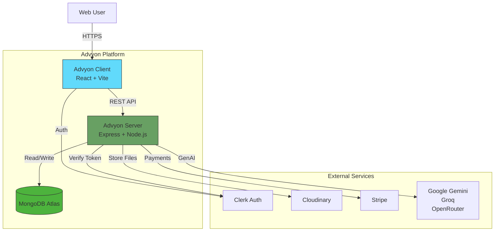
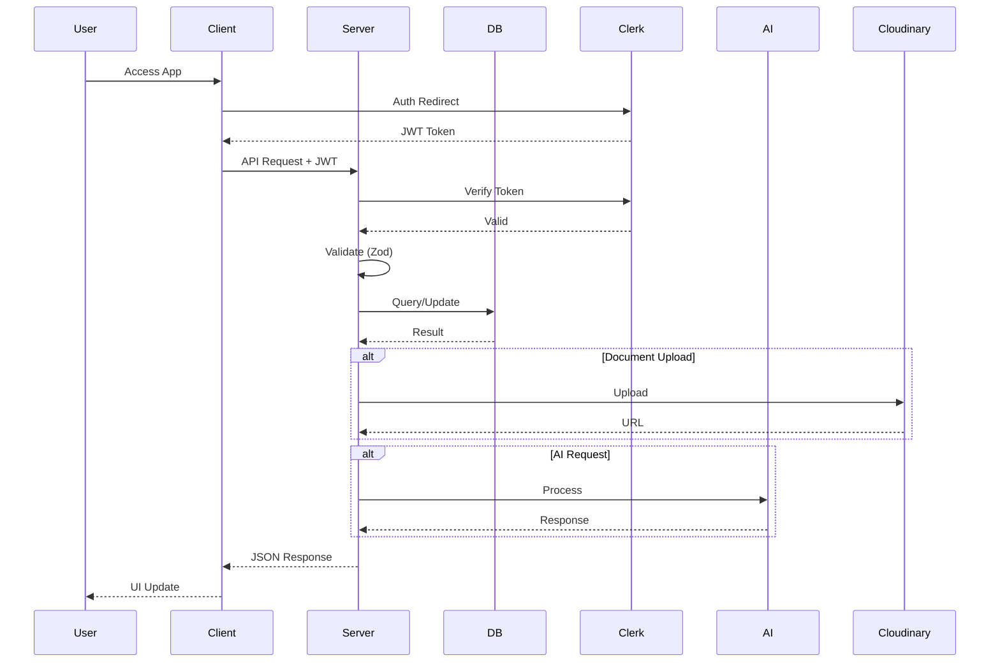
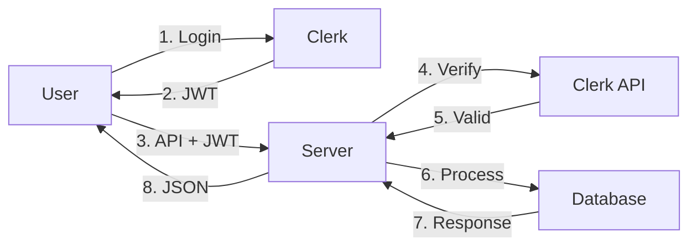
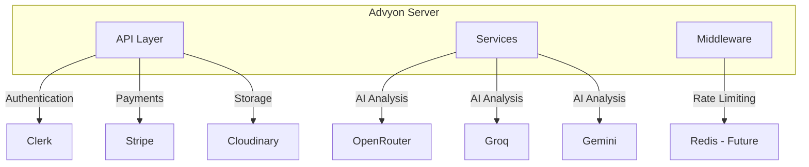

# Architecture Documentation

## System Architecture

### Overview

Advyon Legal Platform follows a modern **Client-Server** architecture with cloud-native services for authentication, storage, and AI processing.

### High-Level Architecture Diagram



## Technology Stack

### Backend (Server)

| Technology | Version | Purpose |
|------------|---------|---------|
| Node.js | 18.x+ | Runtime Environment |
| Express.js | 4.x | Web Framework |
| TypeScript | 5.x | Type Safety |
| MongoDB | Atlas | Primary Database |
| Mongoose | 7.x | ODM |
| Zod | 3.x | Validation |
| Clerk | Latest | Authentication |
| Stripe | Latest | Payments |
| Cloudinary | Latest | File Storage |

### Frontend (Client)

| Technology | Version | Purpose |
|------------|---------|---------|
| React | 18.x | UI Framework |
| Vite | 5.x | Build Tool |
| TypeScript | 5.x | Language |
| Tailwind CSS | 3.x | Styling |
| Shadcn UI | Latest | Components |
| Zustand | 4.x | State Management |
| TanStack Query | 5.x | Data Fetching |
| React Router | 6.x | Routing |

## Data Flow



## Directory Structure Pattern

Both Client and Server follow a **Modular/Feature-First** directory structure.

### Server Module Pattern

Each feature (e.g., `User`, `Case`) is self-contained:

```
modules/
└── user/
    ├── user.interface.ts      # TypeScript definitions
    ├── user.model.ts          # Mongoose schema
    ├── user.validation.ts    # Zod validation schemas
    ├── user.controller.ts     # Request handling
    ├── user.service.ts        # Business logic
    ├── user.route.ts          # API route definitions
    ├── user.constant.ts       # Constants
    ├── user.utils.ts          # Utility functions
    └── user.test.ts           # Unit tests
```

### Frontend Feature Pattern

```
features/
└── workspace/
    ├── components/            # Feature-specific components
    │   ├── CaseCard.jsx
    │   ├── CreateCaseModal.jsx
    │   └── ...
    ├── hooks/                 # Feature-specific hooks
    ├── services/              # Feature API calls
    └── index.js               # Exports
```

## Security Architecture

### Authentication Flow



### Security Layers

1. **Edge Security**
   - Rate Limiting (20k/hour global, 20/15min auth)
   - CORS configuration
   - Helmet.js headers

2. **Application Security**
   - JWT verification via Clerk
   - Role-based access control
   - Request validation (Zod)

3. **Data Security**
   - Password hashing (Bcrypt)
   - Soft delete pattern
   - Field-level security (select: 0)

## Scalability Considerations

### Horizontal Scaling Ready

- Stateless API design
- Session data in JWT
- Database connection pooling
- Rate limiting per IP

### Caching Strategy

- MongoDB indexes for common queries
- Cloudinary CDN for static assets
- React Query caching for client

### Future Enhancements

- Microservices architecture
- Redis for session caching
- CDN for media assets
- WebSocket for real-time features

---

## Component Architecture

### Frontend Components Hierarchy

```
App
├── AppLayout (Public)
│   ├── Navbar
│   │   ├── Logo
│   │   ├── Navigation
│   │   └── AuthButtons
│   ├── Routes
│   │   ├── Home
│   │   ├── About
│   │   ├── Contact
│   │   └── Auth...
│   └── Footer
│
├── DashboardLayout (Protected)
│   ├── Sidebar
│   │   ├── Logo
│   │   ├── Navigation
│   │   │   ├── Dashboard
│   │   │   ├── Workspace
│   │   │   ├── Documents
│   │   │   ├── Schedule
│   │   │   ├── Community
│   │   │   ├── AI Tools
│   │   │   └── ...
│   │   └── UserMenu
│   ├── Header
│   │   ├── Search
│   │   ├── Notifications
│   │   └── Profile
│   ├── Routes
│   │   ├── Dashboard
│   │   ├── WorkspacePage
│   │   ├── SchedulePage
│   │   └── ...
│   └── AIAssistant (Floating)
│
└── AuthLayout
    ├── SignInPage
    ├── SignUpPage
    └── AuthSuccessPage
```

### State Management Flow

```
User Action
    │
    ▼
Component
    │
    ▼
Zustand Store / TanStack Query
    │
    ├──► API Call
    │         │
    │         ▼
    │    Server
    │         │
    │         ▼
    │    Database
    │
    ▼
State Update
    │
    ▼
UI Re-render
```

---

## Integration Architecture

### External Services Integration



### Webhook Handlers

| Service | Webhook | Purpose |
|---------|---------|---------|
| Stripe | `payment_intent.succeeded` | Record payment |
| Stripe | `invoice.payment_succeeded` | Update subscription |
| Stripe | `customer.subscription.deleted` | Cancel access |
| Clerk | `user.deleted` | Sync deletion |

---

## Performance Architecture

### Optimization Strategies

1. **Database**
   - Proper indexing
   - Query optimization
   - Connection pooling
   - Soft deletes

2. **API**
   - Rate limiting
   - Response caching
   - Pagination
   - Field selection

3. **Frontend**
   - Code splitting
   - Lazy loading
   - Image optimization
   - Bundle analysis

### Monitoring Points

- API response times
- Database query performance
- Error rates
- User engagement metrics

---

*Last Updated: March 2026*
