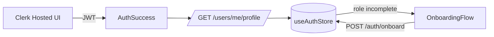

# Auth & Identity Experience

## Overview
The Advyon client authenticates users through Clerk-hosted flows and synchronizes role metadata via our API. Public routes (`/auth/signin`, `/auth/signup`) render Clerk-powered components, while `/auth/success` finalizes sessions and hands control to the Onboarding wizard when additional profile data is required.

**Entry points**
- `SignInPage.jsx`, `SignUpPage.jsx`, `AuthSuccessPage.jsx` under `src/pages/auth/`
- Shared visual components (`SignInForm`, `SignUpForm`, `VerificationForm`, `BarIdUploader`) in `src/features/auth/components`
- `<RequireRole />` guard for dashboard-only routes (`src/components/auth/RequireRole.jsx`)

> Source: advyon-client/src/pages/auth/SignInPage.jsx (c73ac5a)
> Source: advyon-client/src/features/auth/components/VerificationForm.jsx (c73ac5a)
> Source: advyon-client/src/components/auth/RequireRole.jsx (c73ac5a)

## State & Data Flow
- `useAuthStore` (`src/store/useAuthStore.js`) fetches `/users/me/profile`, merges updates, and exposes loading/error flags to all layouts.
- `useOnboardingStore` keeps multi-step data (role selection, profile fields) persisted via `zustand/middleware` until `/auth/onboard` succeeds.
- Successful Clerk login triggers `AuthSuccessPage` ? `useAuthStore.fetchProfile()` ? optional onboarding redirect.

> Source: advyon-client/src/store/useAuthStore.js (c73ac5a)
> Source: advyon-client/src/features/onboarding/components/OnboardingFlow.jsx (c73ac5a)
> Source: advyon-server/src/app/modules/auth/auth.route.ts (c73ac5a)

## Key Behaviors
| Scenario | UX Behavior | Backend Calls |
|----------|-------------|---------------|
| Lawyer submits verification info | `VerificationForm` uploads bar ID, toggles extra fields, and hands payload to `/auth/onboard` | `POST /auth/onboard` (role enum), `PATCH /users/me/profile` |
| Returning user loads dashboard | `DashboardLayout` waits for `useAuthStore.user` and shows skeletons if `isLoading` | `GET /users/me/profile`, `GET /users/me/preferences` |
| Guarded route visit | `<RequireRole>` checks `allowedRoles` and redirects unauthorized users to `/dashboard` or `/auth/signin` | n/a (client guard), server double-checks via `auth()` middleware |

## Integration Notes
- Clerk session tokens are passed as `Authorization: Bearer <jwt>`; the API auto-syncs missing users via `/auth/sync`.
- Auth pages share the same 3D/particle components (`FloatingParticles`, `MouseSpotlight`) for consistent branding.
- All auth-related errors bubble into `useAuthStore.error` so toast handlers can surface them globally.

> Source: advyon-server/src/app/middlewares/auth.ts (c73ac5a)
> Source: advyon-client/src/features/auth/components/FloatingParticles.jsx (c73ac5a)

