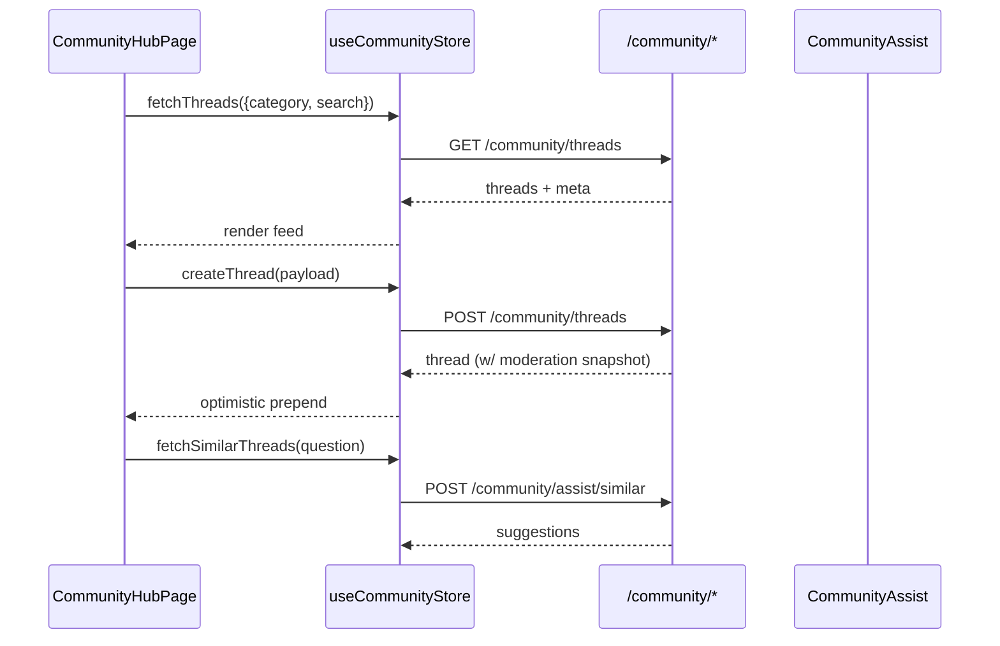

# Community Hub & Gamification

## Overview
Community features give clients and professionals a moderated Q&A space with AI assistance and reputation scoring.

**Screens**
- `CommunityHubPage.jsx` - category filters, trending sidebar, AI summaries
- `ThreadDetailPage.jsx` - rich thread view with replies, accepted answers
- `AskQuestionPage.jsx` - standalone composer for long-form questions

> Source: advyon-client/src/pages/dashboard/CommunityHubPage.jsx (c73ac5a)
> Source: advyon-client/src/pages/dashboard/ThreadDetailPage.jsx (c73ac5a)
> Source: advyon-client/src/pages/dashboard/AskQuestionPage.jsx (c73ac5a)

**Components** (`src/features/community/components`)
- Creation: `QuestionForm`, `CreateThreadModal`
- Discovery: `ThreadFeed`, `ThreadCard`, `TrendingSidebar`, `SimilarQuestions`
- Replies: `ReplyCard`, `ReplyForm`, `AISummary`

## State & Data Flow
- `useCommunityStore` (`src/store/useCommunityStore.js`) manages thread lists, replies, AI assists, and optimistic vote mutations.
- AI helper requests hit `/community/assist/*` endpoints before the result is cached in store state.
- Moderation & gamification metadata (vote counts, accepted answers) render directly from API payloads.

> Source: advyon-client/src/store/useCommunityStore.js (c73ac5a)
> Source: advyon-server/src/app/modules/community/community.route.ts (c73ac5a)
> Source: advyon-server/src/app/modules/gamification/gamification.service.ts (c73ac5a)

## Gamification Hooks
- Posting threads/replies calls `GamificationService.awardPoints` on the API; client surfaces totals via `user.points`.
- Leaderboards: `/community/top-contributors` populates sidebar leader cards.
- Weekly resets are handled server-side but exposed in UI via badges.

## Integration Checklist
| Feature | API | UI Hooks |
|---------|-----|----------|
| Voting threads/replies | `PATCH /community/threads/:id/vote`, `PATCH /community/replies/:replyId/vote` | Optimistic updates + rollback in case of failure |
| AI summarization | `GET /community/threads/:id/summary-ai` | `ThreadDetailPage` displays `AISummary` card |
| Moderation queue surfacing | `/community/moderation/*` | Admin-only dashboards (future) |

> Source: advyon-server/src/app/modules/community/community.service.ts (c73ac5a)

