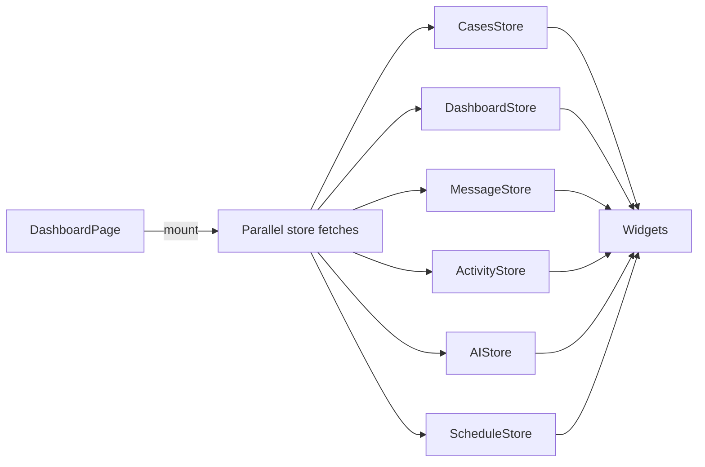

# Dashboard & Analytics Surfaces

## Overview
After authentication, users land on `Dashboard.jsx`, which aggregates KPIs, case shortcuts, AI insights, and pending tasks tailored to their role.

**Primary screens/components**
- `Dashboard.jsx` (role-aware widgets, quick actions, AI assistant entry point)
- `DashboardLayout.jsx` (sidebar, top nav, sockets for counters)
- Widgets reused inside `src/features/dashboard` (e.g., `DashboardView`, `WorkspaceSection`)

> Source: advyon-client/src/pages/Dashboard.jsx (c73ac5a)
> Source: advyon-client/src/layouts/DashboardLayout.jsx (c73ac5a)
> Source: advyon-client/src/features/workspace/components/DashboardView.jsx (c73ac5a)

## State & Data Providers
| Store | Purpose |
|-------|---------|
| `useDashboardStore` | Fetches `/dashboard/stats` and `/dashboard/unified` for cards |
| `useCasesStore` | Supplies recent cases + quick navigation links |
| `useMessageStore` | Surfaces pending client requests and unread counts |
| `useActivityStore` | Shows recent activity feed timestamps |
| `useAIStore` | Renders insights & summaries in dashboard panels |
| `useScheduleStore` | Pulls today’s hearings/events |

> Source: advyon-client/src/store/useDashboardStore.js (c73ac5a)
> Source: advyon-client/src/store/useMessageStore.js (c73ac5a)
> Source: advyon-client/src/store/useActivityStore.js (c73ac5a)
> Source: advyon-client/src/store/useAIStore.js (c73ac5a)
> Source: advyon-client/src/store/useScheduleStore.js (c73ac5a)

## Flow Diagram

## Analytics & Admin Views
- `/dashboard/analytics` (`AnalyticsPage.jsx`) consumes `/analytics/metrics/cases|clients|deadlines` plus chart data.
- `/dashboard/admin` (`AdminPanelPage.jsx`) centralizes user provisioning, feature toggles, and audit data; relies on admin-only API routes.
- `/dashboard/clients` lists client accounts powered by `useCasesStore` + `/users/my-clients`.

> Source: advyon-client/src/pages/dashboard/AnalyticsPage.jsx (c73ac5a)
> Source: advyon-client/src/pages/dashboard/AdminPanelPage.jsx (c73ac5a)
> Source: advyon-client/src/pages/dashboard/ClientsPage.jsx (c73ac5a)
> Source: advyon-server/src/app/modules/analytics/analytics.route.ts (c73ac5a)

## Messaging & AI Shortcuts
- Quick actions on the dashboard trigger modals for creating cases, uploading documents, or launching the AI Copilot (`AIToolsPage.jsx`).
- Widgets subscribe to Socket.io sidebar counters to reflect unread messages and alerts in real time.

> Source: advyon-client/src/pages/dashboard/AIToolsPage.jsx (c73ac5a)
> Source: advyon-server/src/app/modules/socket/socket.service.ts (c73ac5a)

