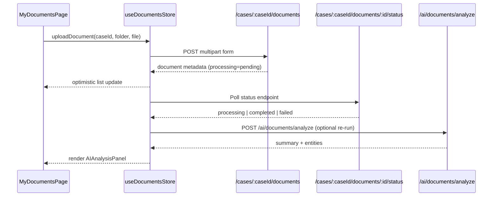

# Document Management & AI Review

## Overview
Document tooling spans upload, browsing, AI enrichment, and PDF review experiences embedded in the workspace and stand-alone dashboards.

**Screens**
- `MyDocumentsPage.jsx` - bulk filtering, status badges, batch actions
- `DocumentViewerPage.jsx` - PDF viewer with AI sidebar and entity highlights
- `TextReviewPage.jsx` - text-focused analysis for extracted content
- Workspace panels inside `WorkspacePage.jsx` reuse the same components

> Source: advyon-client/src/pages/dashboard/MyDocumentsPage.jsx (c73ac5a)
> Source: advyon-client/src/pages/dashboard/DocumentViewerPage.jsx (c73ac5a)
> Source: advyon-client/src/pages/dashboard/TextReviewPage.jsx (c73ac5a)
> Source: advyon-client/src/pages/WorkspacePage.jsx (c73ac5a)

**Components** (`src/features/documents/components`)
- Rendering: `DocumentAdapter`, `PDFViewer`, `PDFToolbar`, `SummaryContent`
- AI insights: `AIAnalysisPanel`, `KeyPointsList`, `EntityHighlight`
- Error boundaries: `DocumentErrorBoundary`

## State & Services
- `useDocumentsStore` caches per-case folders, tracks selected docs, manages upload telemetry, and polls status endpoints.
- `useAllDocuments` (`src/services/documents/documentService.js`) fetches paginated results for dashboard views.
- Uploads go through `useDocumentsStore.uploadDocument()`, integrating telemetry hooks and folder caches.

> Source: advyon-client/src/store/documents.js (c73ac5a)
> Source: advyon-client/src/services/documents/documentService.js (c73ac5a)

## Data Flow

> Source: advyon-server/src/app/modules/document/document.route.ts (c73ac5a)
> Source: advyon-server/src/app/middlewares/fileUploadSecurity.ts (c73ac5a)
> Source: advyon-server/src/app/modules/ai/ai.route.ts (c73ac5a)

## Feature Highlights
- Category + status chips use shared color maps (see `MyDocumentsPage.jsx`) for consistency.
- Download/preview actions link to `/documents/id/:documentId` with signed URLs.
- AI sidebar shows summary, entities, and recommendations pulled from the document’s `aiAnalysis` field.
- Workspace-integrated document lists respect CaseAccess permissions; unauthorized users never see folders.

