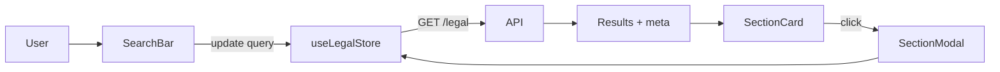

# Legal Research Experience

## Overview
Legal search tools let users browse acts, sections, and metadata sourced from the backend legal corpus.

**Screen**: `LegalSearchPage.jsx` (`/dashboard/legal`)
- Search bar + filters (act, year, category)
- Results list with badges and preview text
- Detail modal for full section context

> Source: advyon-client/src/pages/dashboard/LegalSearchPage.jsx (c73ac5a)

**Components** (`src/features/legal/components`)
- `LegalSearchBar` - debounced text input tied to TanStack Query
- `LegalFilterBar` - dropdown filters for act/year
- `LegalSectionCard` - summary snippet with CTA buttons
- `LegalSectionModal` - full text with metadata tabs

> Source: advyon-client/src/features/legal/components/LegalFilterBar.jsx (c73ac5a)
> Source: advyon-client/src/features/legal/components/LegalSectionModal.jsx (c73ac5a)

## State & API
- `useLegalStore` (`src/store/legal.js`) manages pagination meta, selected record, and helper queries.
- API: `GET /legal` with query params (`search`, `actName`, `year`, `page`, `limit`) plus `GET /legal/:id` for detail view.
- Section-by-number helper uses `fetchSectionByNumber(actName, number)` for quick cross-references from AI outputs.

> Source: advyon-client/src/store/legal.js (c73ac5a)
> Source: advyon-server/src/app/modules/legal/legal.route.ts (c73ac5a)

## Flow

## Integrations
- AI Copilot links legal references to `fetchSectionByNumber` so assistants can deep-link into the catalog.
- Metadata chips reuse the global `Metadata` collection, ensuring filters stay consistent with admin-configured vocab.

