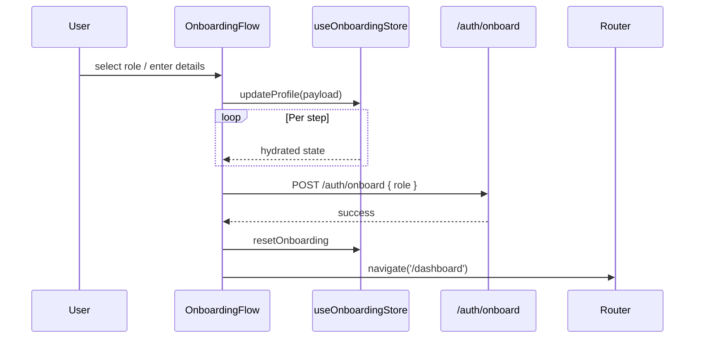

# Onboarding Wizard

## Overview
After Clerk sign-in, new users complete a role-specific onboarding flow that collects required profile data before granting workspace access.

**Entrypoint**: `OnboardingPage.jsx` renders `<OnboardingFlow />` from `src/features/onboarding/components/OnboardingFlow.jsx`.

> Source: advyon-client/src/pages/OnboardingPage.jsx (c73ac5a)
> Source: advyon-client/src/features/onboarding/components/OnboardingFlow.jsx (c73ac5a)

## Flow
- Step 1: Choose role (lawyer, client, judge) with animated cards.
- Step 2+: Multi-step form (`StepInput`, `SelectInput`) collects details (language, timezone, bar info, addresses).
- Final step previews summary + consent before calling `/auth/onboard` + `/users/me/profile`.

> Source: advyon-client/src/store/onboarding.js (c73ac5a)
> Source: advyon-server/src/app/modules/auth/auth.route.ts (c73ac5a)

## Visual System
- `VisualEffects.jsx` adds gradient backgrounds + particle layers.
- Components live in `src/features/onboarding/components`, enabling reuse when editing the flow.

## Integration Tips
- `useAuthStore.fetchProfile()` should run immediately after onboarding completes to refresh role + preferences.
- The store persists to `localStorage` (`advyon-onboarding-storage`) so refreshes don’t wipe in-progress forms.

