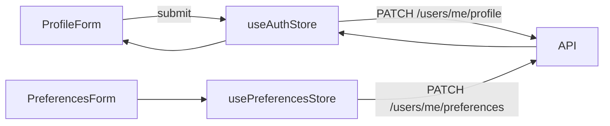

# Profile & Preferences

## Overview
Profile surfaces allow users to manage personal details, preferences, and verification artifacts.

**Screens**
- `ProfilePage.jsx` - general information, avatar upload, notification preferences
- `LawyerVerificationPage.jsx` - dedicated wizard for bar verification (lawyers/admins)

> Source: advyon-client/src/pages/dashboard/ProfilePage.jsx (c73ac5a)
> Source: advyon-client/src/pages/dashboard/LawyerVerificationPage.jsx (c73ac5a)

**Components** (`src/features/profile/components`)
- `ProfileForm`, `ProfileHeader` - layout + summary cards
- `AvatarUploader` - uses Cloudinary + Clerk image helpers
- `PreferencesForm` - toggles theme, dashboard layout, notification settings

> Source: advyon-client/src/features/profile/components/ProfileForm.jsx (c73ac5a)
> Source: advyon-client/src/features/profile/components/PreferencesForm.jsx (c73ac5a)

## State & APIs
- `useAuthStore.updateProfile()` calls `PATCH /users/me/profile` and merges the response locally.
- `usePreferencesStore` handles `GET/PATCH /users/me/preferences`, enabling optimistic preview.
- Verification uploads reuse components from `features/auth` (Bar ID, doc attachments) and submit to `/auth/onboard` or admin endpoints depending on status.

> Source: advyon-client/src/store/useAuthStore.js (c73ac5a)
> Source: advyon-client/src/store/usePreferencesStore.js (c73ac5a)
> Source: advyon-server/src/app/modules/user/user.route.ts (c73ac5a)

## Flow

## Notes
- Profile data combines Clerk info (name/email) with Advyon-specific fields (practice area, verification status).
- Role badges reflect `user.role` so admins can verify status quickly.
- Changes to notification settings update `Notification` delivery channels server-side.

