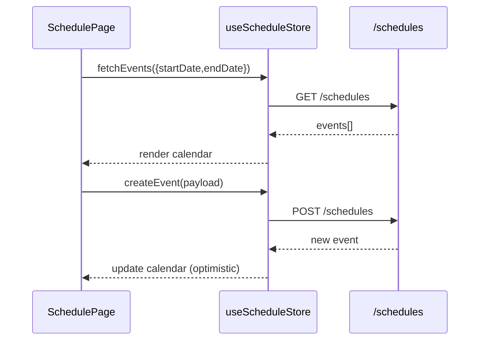

# Scheduling & Calendar

## Overview
Calendar tooling manages hearings, meetings, filings, and reminders with recurring support.

**Screens**
- `SchedulePage.jsx` (`/dashboard/schedule`) - timeline + calendar views, filtering by case/event type
- `CreateEventPage.jsx` - modal-like page for adding/editing events, recurrence, participants

> Source: advyon-client/src/pages/dashboard/SchedulePage.jsx (c73ac5a)
> Source: advyon-client/src/pages/dashboard/CreateEventPage.jsx (c73ac5a)

**Components**
- `ScheduleDetailModal.jsx` (src/features/schedule/components) - shows metadata, participants, reminders
- Shared UI from `@fullcalendar/*` packages for calendar grids

## State & API
- `useScheduleStore` (`src/store/useScheduleStore.js`) wraps `/schedules`, `/schedules/today`, `/schedules/:id` and caches selected events.
- Events map to the backend `Schedule` model (supports recurrence + reminders).

> Source: advyon-client/src/store/useScheduleStore.js (c73ac5a)
> Source: advyon-server/src/app/modules/schedule/schedule.route.ts (c73ac5a)

## Flow

## Integrations
- Upcoming deadlines widget on the dashboard consumes `useScheduleStore.fetchTodayEvents()`.
- Recurrence + reminder metadata align with backend cron jobs (email/push) for future automation.
- Components share color palettes with case urgency levels for visual consistency.

