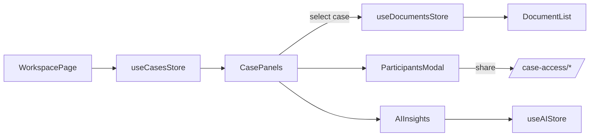

# Workspace & Case Operations

## Overview
The workspace is the heart of the application, combining case lists, detail panels, document summaries, and collaboration controls.

**Screens & Components**
- `WorkspacePage.jsx` - toggles between dashboard and workspace views, supports `/dashboard/workspace/:caseId`
- `WorkspaceView.jsx`, `DashboardView.jsx` (`src/features/workspace/components`) - render case tiles, filters, and detail panes
- Case collaboration controls: `ParticipantsModal`, `PermissionsToggles`, `EmailSearchInput`
- Document previews: `DocumentItem`, `DocumentAdapter`

> Source: advyon-client/src/pages/WorkspacePage.jsx (c73ac5a)
> Source: advyon-client/src/features/workspace/components/WorkspaceView.jsx (c73ac5a)
> Source: advyon-client/src/features/workspace/components/CreateCaseModal.jsx (c73ac5a)

## State Dependencies
| Store | Usage |
|-------|-------|
| `useCasesStore` | Fetches/creates/archives cases, tracks active case ID, manages document caches |
| `useDocumentsStore` | Provides per-case folder data + AI analysis state |
| `useActivityStore` | Pulls activity timelines per case |
| `useMessageStore` | Supplies case-related messages for quick replies |
| `useScheduleStore` | Shows hearings/tasks tied to selected case |

> Source: advyon-client/src/store/cases.js (c73ac5a)
> Source: advyon-client/src/store/documents.js (c73ac5a)
> Source: advyon-client/src/store/useActivityStore.js (c73ac5a)

## Flow

> Source: advyon-server/src/app/modules/case/case.route.ts (c73ac5a)
> Source: advyon-server/src/app/modules/caseAccess/caseAccess.route.ts (c73ac5a)

## Collaboration & Sharing
- `ParticipantsModal` invokes `/case-access/share`, `/case-access/:caseId/users`, `/case-access/:caseId/:userId` depending on action.
- Role badges + toggles show what each collaborator can do (viewer/editor/admin) based on backend enums.

## Automation & Timers
- Widgets like `TimerWidget.jsx` surface SLA timers per case stage.
- `CreateCaseModal` seeds metadata (folders, urgency) and immediately calls `useCasesStore.createCase` ? `POST /cases`.

Workspace keeps the same 3D background + timer styling across cases thanks to `WorkspaceBackground.jsx`.

