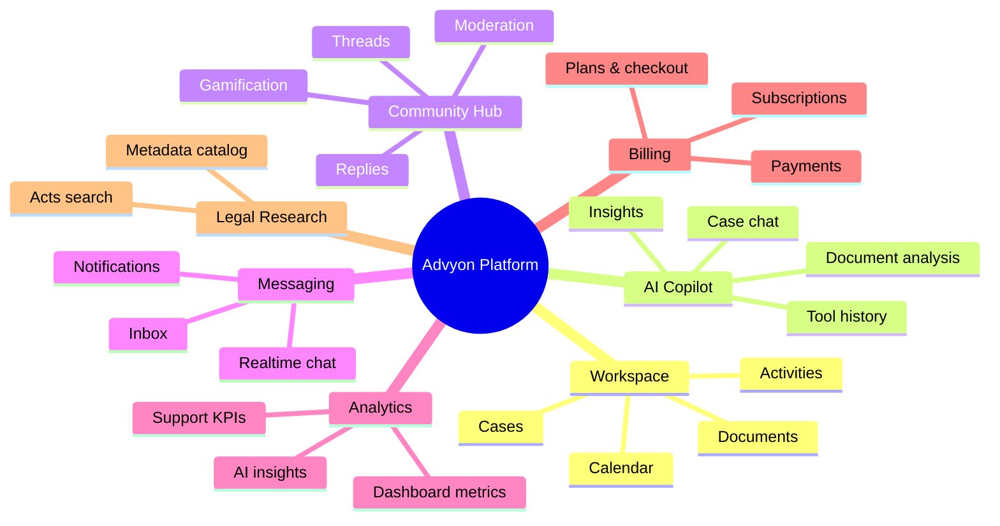
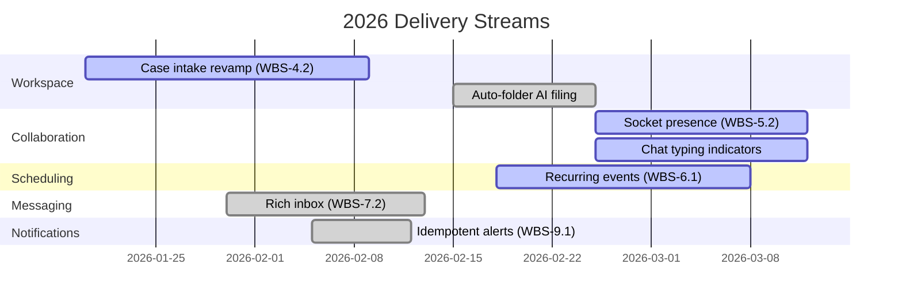

# Feature Overview & Roadmap

## Capability Matrix
| Feature | Frontend Entry Points | Backend Modules | Description |
|---------|----------------------|-----------------|-------------|
| Case & Workspace Management | `WorkspacePage.jsx`, `useCasesStore`, `useDocumentsStore` | `case`, `document`, `caseAccess`, `activity` | Create/update cases, manage folders, upload AI-enriched documents, and share access per collaborator |
| AI Copilot & Tools | `AIToolsPage.jsx`, `useAIStore` | `ai` (chat, tools, context), `document` | Conversational assistant, document analysis, tool history/metrics with personalization profiles |
| Community Hub & Gamification | `CommunityHubPage.jsx`, `useCommunityStore` | `community`, `gamification`, `community.moderation`, `community.kpi` | Threaded Q&A with AI moderation, smart tags, engagement metrics, and point-based leaderboards |
| Messaging & Chat | `ChatPage.jsx`, `useChatStore`, `useMessageStore` | `message`, `chat`, `socket` | Structured inbox plus realtime one-on-one chat over Socket.io rooms with typing indicators |
| Analytics & Dashboards | `Dashboard.jsx`, `useDashboardStore`, `useAnalyticsStore` | `dashboard`, `analytics`, `schedule`, `insight` | Unified dashboard API aggregates case stats, client metrics, upcoming deadlines, and AI insights |
| Billing & Subscription | `BillingPage.jsx`, Stripe components | `subscription`, `payment`, `stripe` webhook | Self-serve plan selection, portal access, cancellation, plus admin payment history |
| Legal Research | `LegalSearchPage.jsx`, `useLegalStore` | `legal`, `metadata` | Search statutes/sections, fetch single acts, and reuse metadata (practice areas, languages) |

> Source: advyon-client/src/pages/WorkspacePage.jsx (c73ac5a)
> Source: advyon-client/src/store/useAIStore.js (c73ac5a)
> Source: advyon-client/src/store/useCommunityStore.js (c73ac5a)
> Source: advyon-server/src/app/modules/case (c73ac5a)
> Source: advyon-server/src/app/modules/ai (c73ac5a)
> Source: advyon-server/src/app/modules/community/community.service.ts (c73ac5a)

## Feature Mind Map

## Release Timeline (WBS Hooks)

- Timeline items mirror inline WBS tags inside the codebase (e.g., `schedule.model.ts` for recurring events, `message.model.ts` for rich inbox, `socket.service.ts` for presence and sidebar counters).

> Source: advyon-server/src/app/modules/schedule/schedule.model.ts (c73ac5a)
> Source: advyon-server/src/app/modules/message/message.model.ts (c73ac5a)
> Source: advyon-server/src/app/modules/socket/socket.service.ts (c73ac5a)
> Source: advyon-server/src/app/modules/notification/notification.model.ts (c73ac5a)

## Feature Dependencies & Data Contracts
- **Workspace** calls `/cases`, `/cases/:caseId/documents`, `/cases/:caseId/documents/:documentId/status`; the last endpoint ensures AI analysis status surfaces in UI. Documents reference Cloudinary IDs so offline exports can use `cloudinaryUrl`.
- **AI Tools** rely on `/ai/chat`, `/ai/tools/:toolKey/run`, `/ai/tools/history`, `/ai/tools/history/export`, and `/ai/tools/metrics`. Frontend passes `history` as `{role,content}` arrays; server rehydrates `AIConversationContext` before calling Groq/OpenRouter.
- **Community** features call `/community/threads`, `/community/threads/:id`, `/community/threads/:threadId/reply`, `/community/threads/:threadId/summary-ai`, and `/community/assist/*` routes for AI helpers. Gamification runs in the background when replies are approved.
- **Billing** surfaces `/subscriptions/plans` publicly, but `checkout`, `portal`, `cancel`, and `verify-checkout` endpoints require auth. `/payments/me` feeds Billing history cards, while `/payments/all` powers the admin panel.

> Source: advyon-server/src/app/modules/ai/ai.route.ts (c73ac5a)
> Source: advyon-server/src/app/modules/community/community.route.ts (c73ac5a)
> Source: advyon-server/src/app/modules/subscription/subscription.route.ts (c73ac5a)
> Source: advyon-server/src/app/modules/payment/payment.route.ts (c73ac5a)

## Personas & Value Props
| Persona | Goals | Supported Features |
|---------|-------|--------------------|
| Staff Attorney | Manage caseload, collaborate with clients, get AI summaries | Workspace, AI Copilot, Calendar, Messaging |
| Client | Upload documents, track case status, ask questions | Workspace sharing (via CaseAccess), Notifications, Community Hub |
| Admin / Ops | Monitor billing, enforce compliance, configure features | Billing, Payments, Admin routes, Analytics KPIs, System Settings |
| Community Member | Ask/answer legal questions and earn reputation | Community Hub, Gamification, AI moderation |

> Source: advyon-server/src/app/modules/caseAccess/caseAccess.route.ts (c73ac5a)
> Source: advyon-server/src/app/modules/community/community.service.ts (c73ac5a)
> Source: advyon-server/src/app/modules/subscription/subscription.route.ts (c73ac5a)

