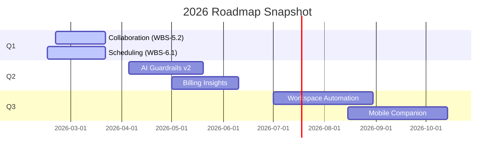

# Product Roadmap

## Near-Term Epics (Q1 2026)
| Epic | Scope | Status | Dependencies |
|------|-------|--------|--------------|
| WBS-4.2 Case Lifecycle | Archived case view, permanent delete, restore UX | ?? Released (routes + store logic complete) | Case routes, `useCasesStore`
| WBS-5.2 Collaboration | Socket presence, sidebar counters, chat typing indicators | ?? In progress (Socket service emits events; UI wiring underway) | Socket.io service, `useChatStore`
| WBS-6.1 Scheduling | Recurring events, reminders, Google Calendar sync stubs | ?? In progress (data model committed; UI hooking next) | `schedule.model.ts`, dashboard calendar
| WBS-7.2 Messaging | Advanced inbox with attachments, read receipts, thread hierarchy | ?? API + store done; UI polish pending | Message module, notifications
| WBS-9.1 Notifications | Idempotent notifications + multi-channel toggle | ?? Completed | Notification module, socket service

> Source: advyon-server/src/app/modules/case/case.route.ts (c73ac5a)
> Source: advyon-client/src/store/cases.js (c73ac5a)
> Source: advyon-server/src/app/modules/socket/socket.service.ts (c73ac5a)
> Source: advyon-client/src/store/useChatStore.js (c73ac5a)
> Source: advyon-server/src/app/modules/schedule/schedule.model.ts (c73ac5a)
> Source: advyon-server/src/app/modules/message/message.model.ts (c73ac5a)
> Source: advyon-server/src/app/modules/notification/notification.model.ts (c73ac5a)

## Mid-Term Initiatives (Q2–Q3 2026)
1. **AI Guardrails v2** – extend moderation + prompt firewalls to case chat and document workflows; integrate policy enforcement dashboards.
2. **Billing Insights** – tie `/payments/all` data into analytics dashboards, enabling ARR/MRR charts and churn metrics.
3. **Workspace Automation** – auto-template cases using `CaseTemplates`, expand document auto-filing accuracy, and expose AI-generated checklists.
4. **Mobile Companion** – React Native or Capacitor shell leveraging existing REST + socket stack; scoped after desktop parity.

## Release Timeline Snapshot

## Stakeholder Alignment
- **Engineering** tracks commitments in `documentation_plan.md` (Workstreams WS0–WS8) with owners per skill/agent.
- **Product & Success** capture risks and sign-offs in `reports/merge-checklist.md` before each release.
- **Design/UX** maintain landing media in `landing/` (read-only unless coordinated) and attach mockups to PRs touching UI.

> Source: documentation_plan.md (c73ac5a)
> Source: reports/merge-checklist.md (c73ac5a)
> Source: AGENTS.md (c73ac5a)

## Requests & Feedback Loop
- Open roadmap change requests via GitHub Discussions or the `Product` Slack channel; mirror decisions into `guides/roadmap.md` so MkDocs stays the canonical source.
- Stakeholders can preview upcoming features via `mkdocs serve` screenshots or deploy previews (Vercel/Render). Attach those links to `reports/` entries for auditability.

