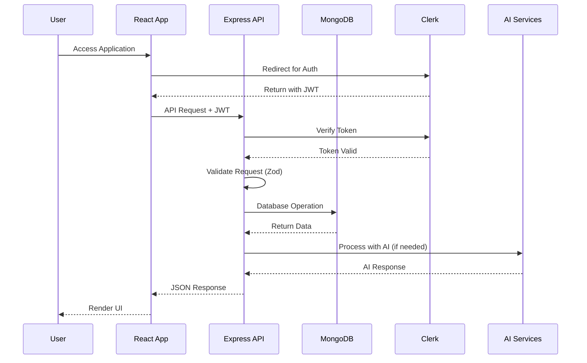
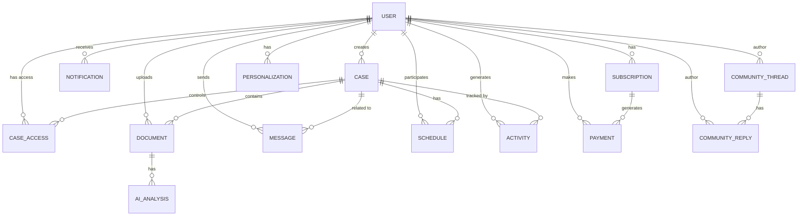

# Advyon Legal Platform - Comprehensive Technical Documentation

## Table of Contents

1. [Project Overview](#project-overview)
2. [System Architecture](#system-architecture)
3. [Database Schema & Models](#database-schema--models)
4. [API Reference](#api-reference)
5. [Frontend Architecture](#frontend-architecture)
6. [AI Integrations](#ai-integrations)
7. [Security Implementation](#security-implementation)
8. [Feature Documentation](#feature-documentation)
9. [Testing Strategy](#testing-strategy)
10. [Development Setup](#development-setup)

---

## Project Overview

### Introduction

Advyon is a **next-generation legal practice management platform** powered by artificial intelligence. It provides a comprehensive suite of tools for legal professionals to manage cases, documents, clients, and communications efficiently. The platform leverages modern cloud-native technologies and AI capabilities to streamline legal workflows.

### Core Values

- **AI-Powered Efficiency**: Leveraging Google Gemini, Groq, and OpenRouter for document analysis, case insights, and intelligent assistance
- **Modern User Experience**: React-based SPA with real-time updates and intuitive interfaces
- **Secure & Compliant**: Enterprise-grade security with Clerk authentication, role-based access, and data encryption
- **Scalable Architecture**: Microservices-ready design with MongoDB and cloud storage

### Technology Stack

#### Backend Stack
| Technology | Purpose | Version |
|------------|---------|---------|
| Node.js | Runtime Environment | 18.x+ |
| Express.js | Web Framework | 4.x |
| TypeScript | Language | 5.x |
| MongoDB | Primary Database | Atlas |
| Mongoose | ODM | 7.x |
| Zod | Request Validation | 3.x |
| Clerk | Authentication | Latest |
| Stripe | Payment Processing | Latest |
| Cloudinary | File Storage | Latest |

#### Frontend Stack
| Technology | Purpose | Version |
|------------|---------|---------|
| React | UI Framework | 18.x |
| Vite | Build Tool | 5.x |
| TypeScript | Language | 5.x |
| Tailwind CSS | Styling | 3.x |
| Shadcn UI | Component Library | Latest |
| Zustand | State Management | 4.x |
| TanStack Query | Data Fetching | 5.x |
| React Router | Routing | 6.x |
| Clerk | Authentication | Latest |

#### AI & External Services
| Service | Purpose |
|---------|---------|
| Google Gemini | AI document analysis |
| Groq | Fast LLM inference |
| OpenRouter | Multi-provider AI gateway |
| Cloudinary | Image/document storage |
| Stripe | Subscription billing |

---

## System Architecture

### High-Level Architecture Diagram

```mermaid
graph TB
    subgraph "Client Layer"
        Browser[Web Browser]
        Mobile[Mobile App - Future]
    end

    subgraph "Advyon Platform"
        Client[React SPA<br/>(advyon-client)]
        Server[Express API<br/>(advyon-server)]
    end

    subgraph "Database Layer"
        MongoDB[(MongoDB Atlas)]
    end

    subgraph "External Services"
        Clerk[Clerk Auth]
        Stripe[Stripe Payments]
        Cloudinary[Cloudinary Storage]
        AI[AI Services<br/>Gemini/Groq/OpenRouter]
    end

    Browser -->|HTTPS| Client
    Client -->|REST API| Server
    Server -->|Read/Write| MongoDB
    Server -->|Verify Token| Clerk
    Server -->|Payments| Stripe
    Server -->|File Storage| Cloudinary
    Server -->|AI Inference| AI
```

### Application Flow



### Directory Structure

#### Backend Structure (`advyon-server/`)

```
advyon-server/
├── src/
│   ├── app.ts                    # Express application entry
│   ├── server.ts                  # Server startup
│   ├── scripts/                   # Utility scripts
│   │   └── seedLegalData.ts      # Database seeding
│   └── app/
│       ├── config/               # Configuration files
│       │   ├── index.ts          # Main config
│       │   ├── clerk.config.ts   # Clerk auth config
│       │   ├── stripe.config.ts  # Stripe config
│       │   ├── cloudinary.config.ts
│       │   ├── gemini.config.ts  # Google Gemini
│       │   ├── groq.config.ts    # Groq AI
│       │   ├── openrouter.config.ts
│       │   └── swagger.config.ts
│       ├── modules/              # Feature modules
│       │   ├── auth/             # Authentication
│       │   ├── user/             # User management (includes Lawyer Profiles)
│       │   ├── chat/             # NEW: Real-time chat (WebSocket)
│       │   ├── case/             # Case management
│       │   ├── document/        # Document management
│       │   ├── community/       # Community forum
│       │   ├── message/          # Messaging
│       │   ├── notification/    # Notifications
│       │   ├── schedule/        # Calendar/Scheduling
│       │   ├── ai/              # AI services
│       │   ├── legal/           # Legal database
│       │   ├── payment/         # Payments
│       │   ├── subscription/   # Subscriptions
│       │   ├── activity/       # Activity tracking
│       │   ├── caseAccess/      # Access control
│       │   ├── admin/           # Admin functions
│       │   ├── analytics/      # Analytics
│       │   ├── insight/        # AI insights
│       │   ├── metadata/       # Metadata
│       │   ├── contact/         # Contact forms
│       │   ├── health/          # Health checks
│       │   └── dashboard/       # Dashboard data
│       ├── middlewares/         # Express middlewares
│       │   ├── auth.ts          # JWT verification
│       │   ├── validateRequest.ts
│       │   ├── rateLimiter.ts
│       │   ├── fileUploadSecurity.ts
│       │   ├── globalErrorhandler.ts
│       │   └── notFound.ts
│       ├── errors/               # Error handling
│       │   ├── appError.ts
│       │   ├── handleCastError.ts
│       │   ├── handleDuplicateError.ts
│       │   ├── handleValidationError.ts
│       │   └── handleZodError.ts
│       ├── utils/               # Utility functions
│       │   ├── catchAsync.ts
│       │   ├── sendResponse.ts
│       │   ├── sendEmail.ts
│       │   ├── document.utils.ts
│       │   └── file.upload.utils.ts
│       ├── contracts/           # API contracts
│       └── DB/                  # Database connection
│           └── index.ts
├── tests/                        # Test files
│   ├── smoke/                   # Smoke tests
│   └── contracts/               # Contract tests
├── dist/                        # Compiled output
└── package.json
```

#### Frontend Structure (`advyon-client/`)

```
advyon-client/
├── public/                      # Static assets
├── src/
│   ├── main.jsx                # React entry point
│   ├── index.css               # Global styles
│   ├── App.jsx                 # Root component
│   ├── routes/
│   │   └── index.jsx           # React Router config
│   ├── components/             # Shared components
│   │   ├── ui/                 # Shadcn UI components
│   │   ├── layout/             # Layout components
│   │   ├── auth/               # Auth components
│   │   ├── 3d/                 # Three.js components
│   │   ├── AIAssistant.jsx    # AI chat widget
│   │   ├── Sidebar.jsx         # Navigation
│   │   ├── Navbar.jsx          # Header
│   │   └── SmartFileUploader.jsx
│   ├── pages/                  # Page components
│   │   ├── auth/               # Auth pages
│   │   │   ├── SignInPage.jsx
│   │   │   ├── SignUpPage.jsx
│   │   │   └── AuthSuccessPage.jsx
│   │   ├── dashboard/          # Dashboard pages
│   │   │   ├── Dashboard.jsx
│   │   │   ├── WorkspacePage.jsx
│   │   │   ├── CreateCasePage.jsx
│   │   │   ├── ProfilePage.jsx
│   │   │   ├── SchedulePage.jsx
│   │   │   ├── AnalyticsPage.jsx
│   │   │   ├── CommunityHubPage.jsx
│   │   │   ├── AIToolsPage.jsx
│   │   │   ├── BillingPage.jsx
│   │   │   ├── FindLawyersPage.jsx    # NEW: Lawyer Directory
│   │   │   ├── ChatPage.jsx           # NEW: Real-time Chat
│   │   │   └── ...
│   │   └── public/             # Public pages
│   │       ├── Home.jsx
│   │       ├── AboutPage.jsx
│   │       ├── ContactPage.jsx
│   │       └── ...
│   ├── features/               # Feature modules
│   │   ├── workspace/
│   │   ├── community/
│   │   ├── profile/
│   │   └── schedule/
│   ├── services/               # API services
│   │   ├── auth/
│   │   ├── cases/
│   │   ├── documents/
│   │   ├── users/
│   │   ├── chat/               # NEW: Real-time chat
│   │   └── ...
│   ├── store/                 # Zustand stores
│   │   ├── useAuthStore.js
│   │   ├── useAIStore.js
│   │   ├── useCommunityStore.js
│   │   └── ...
│   ├── hooks/                 # Custom hooks
│   ├── layouts/               # Layout wrappers
│   │   ├── AppLayout.jsx
│   │   ├── DashboardLayout.jsx
│   │   └── AuthLayout.jsx
│   └── lib/                   # Utilities
│       ├── api/               # API client
│       ├── config/            # Env config
│       ├── validation/        # Zod schemas
│       └── stripe/
├── tailwind.config.js
├── vite.config.js
└── package.json
```

---

## Database Schema & Models

### Database Overview

The Advyon platform uses **MongoDB** as its primary database, managed through **Mongoose ODM**. The database contains 26+ collections covering all aspects of the platform.

### Entity Relationship Diagram



### Detailed Schema Documentation

---

### 1. User Model (`User`)

**Purpose**: Stores user account information and preferences

**Collection Name**: `users`

```typescript
{
  // Identity
  id: String,              // Unique identifier (e.g., "USR-0001")
  clerkUserId: String,     // Clerk.com user ID
  email: String,           // User email (unique)
  password: String,        // Hashed password (select: 0)
  
  // Profile
  fullName: String,        // Full name
  displayName: String,     // Display name
  avatarUrl: String,       // Profile picture URL
  phone: String,           // Phone number
  address: String,        // Physical address
  bio: String,            // User biography
  
  // Role & Status
  primaryRole: String,     // Primary role
  role: String,           // "superAdmin" | "admin" | "client" | "lawyer" | "judge"
  status: String,         // "in-progress" | "active" | "inactive" | "blocked"
  isEmailVerified: Boolean,
  isDeleted: Boolean,     // Soft delete flag
  
  // Preferences
  preferredLanguage: String,
  timezone: String,
  preferences: {
    theme: "light" | "dark" | "system",
    notifications: {
      emailDigest: Boolean,
      pushAlerts: Boolean,
      hearingReminders: Boolean
    },
    dashboardConfig: {
      showActivityFeed: Boolean,
      showAIInsights: Boolean,
      defaultView: "classic" | "kanban"
    }
  },
  
  // Gamification
  points: Number,         // Total points
  weeklyPoints: Number,  // Points this week
  lastWeekReset: Date,
  
  // Security
  needsPasswordChange: Boolean,
  passwordChangedAt: Date,
  lastLoginAt: Date,
  deletedAt: Date,
  
  // Timestamps
  createdAt: Date,
  updatedAt: Date
}
```

**Indexes**:
- `id` (unique)
- `clerkUserId` (unique, sparse)
- `email` (unique)
- `role`
- `status`

**Relationships**:
- One-to-Many with Cases (createdBy)
- One-to-Many with Documents (uploadedBy)
- One-to-Many with Messages (senderId, receiverId)
- One-to-Many with CaseAccess (userId)

---

### 2. Case Model (`Case`)

**Purpose**: Represents legal cases/matters

**Collection Name**: `cases`

```typescript
{
  // Identification
  id: String,              // Unique ID (e.g., "CAS-2024-001")
  caseNumber: String,     // Human-readable case number
  title: String,          // Case title
  caseType: String,       // Type of legal matter
  
  // Status & Progress
  status: String,         // "active" | "pending" | "closed" | "archived"
  urgency: String,       // "low" | "medium" | "high" | "critical"
  progress: Number,      // 0-100%
  
  // Dates
  nextDeadline: Date,     // Upcoming deadline
  nextDeadlineDescription: String,
  archivedAt: Date,       // When archived
  permanentDeleteAt: Date,
  
  // Relationships
  createdBy: ObjectId,   // Reference to User
  clientId: ObjectId,   // Reference to User (client)
  archivedBy: ObjectId,  // Reference to User
  templateId: String,   // Case template ID
  
  // Structure
  folders: [{
    name: String,
    order: Number
  }],
  
  // Flags
  isDeleted: Boolean,     // Soft delete
  deletedAt: Date,
  autoArchiveScheduled: Boolean,
  
  // Timestamps
  createdAt: Date,
  updatedAt: Date
}
```

**Indexes**:
- `caseNumber` (unique)
- `status`
- `createdBy`
- `isDeleted`
- `archivedAt`
- Compound: `{ status: 1, archivedAt: 1 }`

**Features**:
- Query middleware automatically excludes deleted cases
- Support for case archiving and restoration

---

### 3. Document Model (`Document`)

**Purpose**: Stores legal documents with AI analysis

**Collection Name**: `documents`

```typescript
{
  // Identification
  id: String,              // Unique ID
  caseId: ObjectId,       // Reference to Case
  folderName: String,     // Folder within case
  
  // File Information
  fileName: String,        // Original filename
  fileType: String,       // MIME type
  fileSize: Number,       // Size in bytes
  
  // Cloudinary Storage
  cloudinaryUrl: String,
  cloudinaryPublicId: String,
  cloudinaryFileId: String,
  
  // AI Processing
  processingStatus: String,  // "pending" | "processing" | "completed" | "failed"
  processingError: String,
  
  // AI Analysis Results
  aiAnalysis: {
    summary: String,           // AI-generated summary
    rawSummary: String,
    keyPoints: String[],       // Key findings
    extractedEntities: Mixed,  // Names, dates, amounts
    legalRefs: [{
      citation: String,
      description: String,
      relevance: "high" | "medium" | "low"
    }],
    documentCategory: String,  // "Affidavit" | "Contract" | etc.
    confidenceScore: Number,  // 0-1
    analyzedAt: Date,
    modelVersion: String
  },
  
  // Auto-Filing (Phase 3.1)
  autoFiling: {
    status: "pending" | "moved" | "manual_override" | "failed",
    originalFolder: String,
    targetFolder: String,
    confidenceScore: Number,
    movedAt: Date
  },
  
  // Legacy
  analysisStatus: String,
  
  // References
  uploaderId: ObjectId,    // Reference to User
  uploadedBy: ObjectId,    // Reference to User (required)
  uploadedAt: Date,
  
  // Soft Delete
  isDeleted: Boolean,
  deletedAt: Date,
  
  // Timestamps
  createdAt: Date,
  updatedAt: Date
}
```

**Indexes**:
- `caseId`
- `folderName`
- `uploadedBy`
- `uploaderId`
- `processingStatus`
- `aiAnalysis.documentCategory`
- Compound: `{ caseId: 1, processingStatus: 1 }`

---

### 4. Community Models (`Thread`, `Reply`)

**Purpose**: Q&A forum for legal community

**Collection Name**: `threads`

```typescript
{
  // Content
  title: String,          // Thread title
  content: String,       // Thread body
  category: String,      // "Family Law" | "Criminal Defense" | etc.
  tags: String[],        // User tags
  
  // Author
  author: ObjectId,      // Reference to User
  
  // Metrics
  views: Number,         // View count
  upvotes: ObjectId[],   // Users who upvoted
  downvotes: ObjectId[], // Users who downvoted
  upvotesCount: Number,
  repliesCount: Number,
  
  // Status
  isSolved: Boolean,     // Has accepted answer
  isVisible: Boolean,    // Not hidden/deleted
  
  // Moderation
  moderation: {
    status: "pending" | "approved" | "review" | "rejected" | "appealed",
    confidence: Number,
    threshold: Number,
    toxicityScore: Number,
    spamScore: Number,
    offTopicScore: Number,
    reasons: String[],
    reviewId: ObjectId,
    lastCheckedAt: Date
  },
  
  // Timestamps
  createdAt: Date,
  updatedAt: Date
}
```

**Collection Name**: `replies`

```typescript
{
  threadId: ObjectId,    // Reference to Thread
  content: String,      // Reply body
  
  // Author
  author: ObjectId,      // Reference to User
  
  // Voting
  upvotes: ObjectId[],
  downvotes: ObjectId[],
  
  // Status
  isAcceptedAnswer: Boolean,
  isVisible: Boolean,
  
  // Moderation
  moderation: { /* same as Thread */ },
  
  // Timestamps
  createdAt: Date,
  updatedAt: Date
}
```

**Indexes (Threads)**:
- `category`
- `author`
- `isSolved`
- `createdAt`

**Indexes (Replies)**:
- `threadId`
- `author`

---

### 5. Message Model (`Message`)

**Purpose**: Internal messaging system

**Collection Name**: `messages`

```typescript
{
  // Participants
  senderId: ObjectId,     // Reference to User
  receiverId: ObjectId,   // Reference to User
  
  // Context
  caseId: ObjectId,       // Reference to Case (optional)
  threadId: String,       // Conversation thread ID
  parentMessageId: ObjectId,  // For replies
  
  // Content
  subject: String,        // Email-style subject
  content: String,       // Message body
  
  // Status
  status: String,         // "unread" | "read" | "replied" | "archived"
  priority: String,      // "low" | "medium" | "high"
  isStarred: Boolean,
  readAt: Date,
  
  // Attachments
  attachments: [{
    name: String,
    url: String,
    type: String,
    size: Number
  }],
  
  // Read Receipts
  readReceipts: [{
    userId: ObjectId,
    readAt: Date
  }],
  
  // Template
  templateId: String,
  
  // Timestamps
  createdAt: Date,
  updatedAt: Date
}
```

**Indexes**:
- `receiverId` + `status`
- `threadId` + `createdAt`
- Text index on `{ subject, content }`

---

### 5.1. Chat Models (Real-time Messaging)

**Purpose**: Real-time 1-on-1 chat between clients and lawyers using WebSocket

#### Conversation Model

**Collection Name**: `conversations`

```typescript
{
  // Participants
  participants: ObjectId[],    // Exactly 2 users
  
  // Message Preview
  lastMessage: String,        // Preview of last message
  lastMessageAt: Date,        // For sorting conversations
  
  // Unread Tracking
  unreadCounts: Map<String, Number>,  // Per-user unread count
  
  // Timestamps
  createdAt: Date,
  updatedAt: Date
}
```

**Indexes**:
- `{ participants: 1 }` - Find conversations between users
- `{ lastMessageAt: -1 }` - Sort by recent

#### ChatMessage Model

**Collection Name**: `chatmessages`

```typescript
{
  // References
  conversationId: ObjectId,    // Reference to Conversation
  senderId: ObjectId,         // Reference to User
  
  // Content
  content: String,            // Message body (max 5000 chars)
  
  // Status
  status: String,            // "sent" | "delivered" | "read"
  readAt: Date,
  
  // Timestamps
  createdAt: Date,
  updatedAt: Date
}
```

**Indexes**:
- `{ conversationId: 1, createdAt: -1 }` - Paginated retrieval

> **Note**: The Chat module uses WebSocket (Socket.io) for real-time messaging. See [Chat API Documentation](api/chat.md) for details.

---

### 6. Notification Model (`Notification`)

**Purpose**: User notifications

**Collection Name**: `notifications`

```typescript
{
  // Content
  type: String,          // "alert" | "request" | "message" | etc.
  priority: String,      // "low" | "medium" | "high"
  title: String,
  message: String,
  
  // Recipients
  recipientId: ObjectId,  // Reference to User
  senderId: ObjectId,     // Reference to User
  
  // Context
  caseId: ObjectId,       // Related case
  metadata: Map,         // Additional data
  
  // Status
  isRead: Boolean,
  
  // Delivery
  idempotencyKey: String,  // Prevent duplicates
  channels: {
    inApp: Boolean,
    email: Boolean,
    webPush: Boolean
  },
  
  // Timestamps
  createdAt: Date,
  updatedAt: Date
}
```

**Indexes**:
- `recipientId` + `isRead`
- `createdAt`
- `idempotencyKey` (sparse)

---

### 7. Schedule Model (`Schedule`)

**Purpose**: Calendar events and scheduling

**Collection Name**: `schedules`

```typescript
{
  // Event Details
  title: String,
  description: String,
  eventType: String,     // "hearing" | "meeting" | "filing" | "deadline" | "other"
  date: Date,
  startTime: String,
  endTime: String,
  location: String,
  
  // Relationships
  caseId: ObjectId,      // Reference to Case
  participants: ObjectId[], // References to Users
  createdBy: ObjectId,   // Reference to User
  
  // Status
  status: String,       // "scheduled" | "completed" | "cancelled" | "postponed"
  
  // Reminders
  reminders: [{
    time: Number,       // Minutes before
    sent: Boolean
  }],
  
  // Recurring Events (Phase 6.1)
  recurrence: {
    frequency: "daily" | "weekly" | "monthly" | "yearly",
    interval: Number,
    endDate: Date,
    daysOfWeek: Number[]
  },
  parentEventId: ObjectId,
  
  // Integration
  resourceId: String,    // Resource booking
  googleCalendarEventId: String,
  
  metadata: Map,
  
  // Timestamps
  createdAt: Date,
  updatedAt: Date
}
```

**Indexes**:
- `caseId`
- `date`
- `participants`
- `recurrence.frequency`
- `resourceId` + `date`

---

### 8. Activity Model (`Activity`)

**Purpose**: Audit trail and activity logging

**Collection Name**: `activities`

```typescript
{
  type: String,        // "case_created" | "document_uploaded" | etc.
  message: String,      // Human-readable description
  userId: ObjectId,    // Reference to User
  caseId: ObjectId,    // Reference to Case
  documentId: ObjectId, // Reference to Document
  metadata: Map,
  
  createdAt: Date
}
```

**Indexes**:
- `createdAt`
- `userId`
- `caseId`

---

### 9. AI Models

#### AIToolHistory Model

```typescript
{
  userId: String,
  toolKey: String,      // Which AI tool was used
  input: String,        // User input
  output: String,       // AI response
  status: String,      // "success" | "blocked" | "failed"
  latencyMs: Number,
  model: String,       // "groq" | "gemini" | etc.
  policySignals: String[],
  metadata: {
    caseId: String,
    documentIds: String[]
  },
  
  createdAt: Date
}
```

#### AIChat Model

```typescript
{
  userId: ObjectId,
  title: String,
  messages: [{
    role: "user" | "assistant" | "system",
    content: String,
    timestamp: Date
  }],
  context: Mixed,
  
  createdAt: Date,
  updatedAt: Date
}
```

---

### 10. Payment & Subscription Models

#### Payment Model

```typescript
{
  user: ObjectId,              // Reference to User
  amount: Number,
  currency: String,            // "usd"
  status: String,             // "succeeded" | "pending" | "failed" | "refunded"
  stripePaymentIntentId: String,
  stripeInvoiceId: String,
  stripeChargeId: String,
  description: String,
  metadata: Mixed,
  
  createdAt: Date,
  updatedAt: Date
}
```

#### Subscription Model

```typescript
{
  user: ObjectId,
  plan: String,               // "free" | "basic" | "pro" | "enterprise"
  status: String,             // "active" | "canceled" | "past_due" | "trialing"
  billingInterval: String,     // "month" | "year"
  stripeCustomerId: String,
  stripeSubscriptionId: String,
  stripePriceId: String,
  currentPeriodStart: Date,
  currentPeriodEnd: Date,
  cancelAtPeriodEnd: Boolean,
  trialEnd: Date,
  
  createdAt: Date,
  updatedAt: Date
}
```

---

### 11. Case Access Model

**Purpose**: Role-based access control for cases

```typescript
{
  caseId: ObjectId,       // Reference to Case
  userId: ObjectId,       // Reference to User
  grantedBy: ObjectId,    // Who granted access
  role: String,           // "viewer" | "editor" | "admin"
  expiresAt: Date,        // Optional expiration
  status: String,         // "active" | "revoked" | "pending"
  
  createdAt: Date,
  updatedAt: Date
}
```

**Indexes**:
- Compound unique: `{ caseId: 1, userId: 1 }`
- `userId`

---

### 12. Legal Model

**Purpose**: Legal acts and statutes database

```typescript
{
  actName: String,        // Name of the act
  year: String,           // Year enacted
  number: String,        // Section number
  title: String,
  chapter: String,
  chapterTitle: String,
  previewText: String,
  fullText: String,       // Complete legal text
  subsections: String[],
  relatedSections: String[],
  isDeleted: Boolean,
  
  createdAt: Date,
  updatedAt: Date
}
```

**Indexes**:
- Unique compound: `{ actName: 1, number: 1 }`
- Text index: `{ title, actName, fullText }`

---

### 13. System Settings Model

**Purpose**: Application-wide configuration (Singleton)

```typescript
{
  siteName: String,
  maintenanceMode: Boolean,
  allowRegistration: Boolean,
  maxUploadSizeMB: Number,
  defaultUserRole: String,
  sessionTimeoutMinutes: Number,
  features: {
    aiTools: Boolean,
    communityHub: Boolean,
    billing: Boolean,
    notifications: Boolean
  },
  updatedBy: String,
  
  createdAt: Date,
  updatedAt: Date
}
```

---

## API Reference

### Base URL

```
Production: https://api.advyon.com/api/v1
Development: http://localhost:5000/api/v1
```

### Authentication

All protected endpoints require a **Bearer Token** in the Authorization header:

```http
Authorization: Bearer <clerk_jwt_token>
```

### Response Format

All responses follow a standardized structure:

```typescript
{
  success: boolean,
  statusCode: number,
  message: string,
  data: any,
  meta?: {
    page?: number,
    limit?: number,
    total?: number,
    totalPage?: number
  }
}
```

### Status Codes

| Code | Status | Description |
|------|--------|-------------|
| 200 | OK | Request succeeded |
| 201 | Created | Resource created successfully |
| 204 | No Content | Successful deletion |
| 400 | Bad Request | Validation error |
| 401 | Unauthorized | Invalid/missing token |
| 403 | Forbidden | Insufficient permissions |
| 404 | Not Found | Resource not found |
| 409 | Conflict | Duplicate entry |
| 422 | Unprocessable | Validation failed |
| 429 | Too Many Requests | Rate limit exceeded |
| 500 | Internal Error | Server error |

### API Endpoints

---

#### 1. Authentication Routes (`/api/v1/auth`)

| Method | Endpoint | Description | Auth Required |
|--------|----------|-------------|---------------|
| POST | `/auth/sync` | Sync user from Clerk | Yes |
| POST | `/auth/login` | User login | No |
| POST | `/auth/register` | User registration | No |
| GET | `/auth/current-user` | Get current user | Yes |

---

#### 2. User Routes (`/api/v1/users`)

| Method | Endpoint | Description | Auth Required |
|--------|----------|-------------|---------------|
| POST | `/users/create-user` | Create user (admin) | No |
| GET | `/users/me/profile` | Get my profile | Yes |
| PATCH | `/users/me/profile` | Update my profile | Yes |
| POST | `/users/me/change-password` | Change password | Yes |
| GET | `/users/me/preferences` | Get preferences | Yes |
| PATCH | `/users/me/preferences` | Update preferences | Yes |
| GET | `/users/me/personalization` | Get personalization | Yes |
| PUT | `/users/me/personalization` | Update personalization | Yes |
| POST | `/users/me/behavior` | Track behavior | Yes |
| GET | `/users/my-clients` | Get lawyer's clients | Lawyer+ |
| GET | `/users/clients/:id` | Get client details | Lawyer+ |
| DELETE | `/users/clients/:id` | Archive client | Lawyer+ |
| GET | `/users` | Get all users | Admin |
| GET | `/users/:id` | Get user by ID | Yes |
| PATCH | `/users/:id` | Update user | Yes |
| DELETE | `/users/:id` | Delete user | Admin |

---

#### 3. Case Routes (`/api/v1/cases`)

| Method | Endpoint | Description | Auth Required |
|--------|----------|-------------|---------------|
| POST | `/cases` | Create new case | Yes |
| GET | `/cases` | Get all cases | Yes |
| GET | `/cases/archived` | Get archived cases | Yes |
| GET | `/cases/templates` | Get case templates | Yes |
| POST | `/cases/check-duplicate` | Check duplicates | Yes |
| GET | `/cases/:caseId` | Get case by ID | Yes |
| PUT | `/cases/:caseId` | Update case | Yes |
| DELETE | `/cases/:caseId` | Delete case (soft) | Yes |
| PATCH | `/cases/:caseId/archive` | Archive case | Yes |
| PATCH | `/cases/:caseId/restore` | Restore case | Yes |
| DELETE | `/cases/:caseId/permanent` | Permanent delete | Yes |
| POST | `/cases/:caseId/documents` | Upload document | Yes |
| GET | `/cases/:caseId/documents` | List documents | Yes |
| GET | `/cases/:caseId/documents/:documentId/status` | Get doc status | Yes |

---

#### 4. Document Routes (`/api/v1/documents`)

| Method | Endpoint | Description | Auth Required |
|--------|----------|-------------|---------------|
| GET | `/documents/my-documents` | My all documents | Yes |
| GET | `/documents/id/:documentId` | Get by ID | Yes |
| GET | `/documents/:caseId/:documentId` | Get document | Yes |
| GET | `/documents/:caseId/:documentId/content` | Get content | Yes |
| GET | `/documents/:caseId/:documentId/status` | Processing status | Yes |
| PUT | `/documents/:documentId/summary` | Update summary | Yes |
| POST | `/documents/:caseId/:documentId/reanalyze` | Re-analyze AI | Yes |
| DELETE | `/documents/:caseId/:documentId` | Delete document | Yes |
| GET | `/documents/:caseId/:documentId/download` | Download | Lawyer+ |
| POST | `/documents/batch-download` | Batch download | Lawyer+ |

---

#### 5. AI Routes (`/api/v1/ai`)

| Method | Endpoint | Description | Auth Required |
|--------|----------|-------------|---------------|
| POST | `/ai/chat` | Chat with AI | Yes |
| POST | `/ai/tools/:toolKey/run` | Run AI tool | Yes |
| GET | `/ai/tools/history` | Tool history | Yes |
| GET | `/ai/tools/history/export` | Export history | Yes |
| GET | `/ai/tools/metrics` | Tool metrics | Lawyer+ |
| GET | `/ai/context/profile` | Get AI context | Yes |
| POST | `/ai/chats` | Create/update chat | Yes |
| GET | `/ai/chats` | Get user chats | Yes |
| GET | `/ai/chats/:id` | Get specific chat | Yes |
| DELETE | `/ai/chats/:id` | Delete chat | Yes |
| POST | `/ai/documents/analyze` | Analyze document | Yes |

---

#### 6. Community Routes (`/api/v1/community`)

| Method | Endpoint | Description | Auth Required |
|--------|----------|-------------|---------------|
| GET | `/community/stats` | Community stats | Public |
| GET | `/community/trending-topics` | Trending topics | Public |
| GET | `/community/top-contributors` | Top users | Public |
| GET | `/community/metrics/engagement` | Engagement metrics | Admin |
| POST | `/community/threads` | Create thread | Client+ |
| GET | `/community/threads` | List threads | Public |
| GET | `/community/threads/:id` | Get thread | Public |
| GET | `/community/threads/:id/summary-ai` | AI summary | Client+ |
| PATCH | `/community/threads/:id/vote` | Vote | Client+ |
| PATCH | `/community/threads/:id/solve` | Mark solved | Client+ |
| POST | `/community/threads/:threadId/reply` | Add reply | Client+ |
| PATCH | `/community/replies/:replyId/vote` | Vote reply | Client+ |

**AI Assistance Endpoints**:
| POST | `/community/assist/similar` | Similar threads | Client+ |
| POST | `/community/assist/smart-tags` | Smart tags | Client+ |
| POST | `/community/assist/answer-suggestion` | Answer help | Client+ |
| POST | `/community/assist/legal-references` | Legal refs | Client+ |

**Moderation Endpoints**:
| GET | `/community/moderation/reviews` | Review queue | Admin |
| PATCH | `/community/moderation/reviews/:reviewId` | Review decision | Admin |
| POST | `/community/moderation/appeals` | Create appeal | Client+ |
| GET | `/community/moderation/appeals` | Appeal queue | Admin |
| PATCH | `/community/moderation/appeals/:appealId` | Resolve appeal | Admin |

---

#### 7. Message Routes (`/api/v1/messages`)

| Method | Endpoint | Description | Auth Required |
|--------|----------|-------------|---------------|
| POST | `/messages` | Send message | Yes |
| GET | `/messages` | Get my messages | Yes |
| GET | `/messages/:id` | Get message | Yes |
| PATCH | `/messages/:id` | Update message | Yes |
| DELETE | `/messages/:id` | Delete message | Yes |
| PATCH | `/messages/:id/read` | Mark as read | Yes |
| POST | `/messages/:id/star` | Star message | Yes |

---

#### 8. Notification Routes (`/api/v1/notifications`)

| Method | Endpoint | Description | Auth Required |
|--------|----------|-------------|---------------|
| GET | `/notifications` | Get notifications | Yes |
| PATCH | `/notifications/:id` | Update notification | Yes |
| DELETE | `/notifications/:id` | Delete notification | Yes |
| PATCH | `/notifications/read-all` | Mark all read | Yes |

---

#### 9. Schedule Routes (`/api/v1/schedules`)

| Method | Endpoint | Description | Auth Required |
|--------|----------|-------------|---------------|
| POST | `/schedules` | Create event | Yes |
| GET | `/schedules` | Get events | Yes |
| GET | `/schedules/:id` | Get event | Yes |
| PUT | `/schedules/:id` | Update event | Yes |
| DELETE | `/schedules/:id` | Delete event | Yes |

---

#### 10. Payment & Subscription Routes

**Payments** (`/api/v1/payments`):
| POST | `/payments/create-intent` | Create payment intent | Yes |
| GET | `/payments/history` | Payment history | Yes |

**Subscriptions** (`/api/v1/subscriptions`):
| POST | `/subscriptions` | Create subscription | Yes |
| GET | `/subscriptions` | Get subscription | Yes |
| PATCH | `/subscriptions` | Update subscription | Yes |
| DELETE | `/subscriptions` | Cancel subscription | Yes |

---

#### 11. Admin Routes (`/api/v1/admin`)

| Method | Endpoint | Description | Auth Required |
|--------|----------|-------------|---------------|
| GET | `/admin/users` | Manage users | Admin |
| PATCH | `/admin/users/:id/status` | Update user status | Admin |
| GET | `/admin/settings` | Get settings | Admin |
| PATCH | `/admin/settings` | Update settings | Admin |
| GET | `/admin/audit-logs` | Audit logs | Admin |
| GET | `/admin/stats` | Platform stats | Admin |

---

#### 12. Legal Routes (`/api/v1/legal`)

| Method | Endpoint | Description | Auth Required |
|--------|----------|-------------|---------------|
| GET | `/legal` | Search legal acts | Yes |
| GET | `/legal/:id` | Get act details | Yes |
| POST | `/legal` | Add legal act | Admin |
| PUT | `/legal/:id` | Update act | Admin |
| DELETE | `/legal/:id` | Delete act | Admin |

---

#### 13. Analytics & Insights Routes

**Analytics** (`/api/v1/analytics`):
| GET | `/analytics/dashboard` | Dashboard stats | Lawyer+ |
| GET | `/analytics/activities` | Activity logs | Lawyer+ |
| GET | `/analytics/support-tickets` | Support metrics | Admin |

**Insights** (`/api/v1/insights`):
| GET | `/insights/me` | My insights | Yes |
| GET | `/insights/dashboard/summary` | Dashboard summary | Yes |

---

#### 14. Dashboard Routes (`/api/v1/dashboard`)

| Method | Endpoint | Description | Auth Required |
|--------|----------|-------------|---------------|
| GET | `/dashboard/stats` | Dashboard stats | Yes |
| GET | `/dashboard/recent-activity` | Recent activities | Yes |
| GET | `/dashboard/upcoming-deadlines` | Upcoming deadlines | Yes |

---

## Frontend Architecture

### Technology Stack

- **React 18** with Vite for fast development
- **TypeScript** for type safety
- **Tailwind CSS** for styling
- **Shadcn UI** for accessible components
- **Zustand** for state management
- **TanStack Query** for server state
- **React Router** for navigation
- **Clerk** for authentication

### State Management

#### Zustand Stores

1. **useAuthStore** - Authentication state
   ```javascript
   {
     user: User | null,
     isAuthenticated: boolean,
     isLoading: boolean,
     login: () => Promise,
     logout: () => Promise
   }
   ```

2. **useAIStore** - AI chat and tools
   ```javascript
   {
     histories: {},
     activeContext: string,
     isSending: boolean,
     analysisResult: null,
     toolHistory: [],
     sendMessage: (caseId, message) => Promise,
     analyzeDocument: (docId) => Promise,
     runTool: (toolKey, input) => Promise
   }
   ```

3. **useCommunityStore** - Community forum
   ```javascript
   {
     threads: [],
     currentThread: null,
     createThread: (data) => Promise,
     voteThread: (id, type) => Promise
   }
   ```

4. **useDashboardStore** - Dashboard data
5. **useScheduleStore** - Calendar events
6. **useMessageStore** - Messages
7. **useActivityStore** - Activity feed
8. **usePreferencesStore** - User preferences

### Routing Structure

```javascript
// Public Routes (AppLayout)
- /                     → Home
- /auth/signin          → Sign In
- /auth/signup          → Sign Up
- /auth/success         → Auth Success
- /onboarding            → Role Selection
- /contact               → Contact
- /about                 → About
- /how-to-use           → How to Use
- /blog                 → Blog
- /terms                → Terms
- /privacy              → Privacy
- /cookies              → Cookie Policy
- /security             → Security
- /accessibility        → Accessibility

// Protected Routes (DashboardLayout)
- /dashboard                   → Main Dashboard
- /dashboard/workspace          → Case Workspace
- /dashboard/workspace/:caseId → Case Details
- /dashboard/cases/new         → Create Case
- /dashboard/cases/active      → Active Cases
- /dashboard/cases/archived   → Archived Cases
- /dashboard/documents        → My Documents
- /dashboard/schedule          → Calendar
- /dashboard/schedule/new      → Create Event
- /dashboard/community         → Community Hub
- /dashboard/community/ask     → Ask Question
- /dashboard/community/thread/:id → Thread Detail
- /dashboard/legal            → Legal Search
- /dashboard/ai-assistant     → AI Tools
- /dashboard/profile          → Profile
- /dashboard/profile/verify   → Lawyer Verification
- /dashboard/clients          → My Clients (Lawyer)
- /dashboard/analytics       → Analytics (Lawyer)
- /dashboard/admin            → Admin Panel
- /dashboard/billing          → Billing
- /dashboard/settings         → Settings
```

### Key Components

#### Layout Components
- **AppLayout** - Public pages wrapper with navigation
- **DashboardLayout** - Protected pages with sidebar
- **AuthLayout** - Authentication pages wrapper

#### UI Components (Shadcn)
- Button, Input, Textarea
- Card, Dialog, Sheet
- Select, Dropdown Menu
- Avatar, Badge
- Table, Pagination
- Calendar, Date Picker
- Form, Label
- Tabs, Accordion
- Scroll Area, Separator

#### Custom Components
- **AIAssistant** - AI chat widget
- **SmartFileUploader** - Drag-drop file upload
- **Sidebar** - Navigation sidebar
- **Navbar** - Header navigation
- **VoteButtons** - Upvote/downvote
- **RichTextEditor** - Markdown editor

---

## AI Integrations

### Overview

Advyon leverages multiple AI providers for different functionalities:

| Provider | Model | Use Case |
|----------|-------|----------|
| OpenRouter | Various | Primary AI gateway |
| Groq | Llama/Gemma | Fast inference |
| Google Gemini | Gemini Pro | Document analysis |

### AI Services

#### 1. Document Analysis (`openrouter.service.ts`)

Analyzes legal documents and extracts:
- Summary
- Key entities (names, dates, amounts)
- Legal references
- Document category
- Confidence score

```typescript
const analyzeLegalDocument = async (fileText: string): Promise<TAiAnalysis> => {
  // Uses OpenRouter with system prompt
  // Returns structured JSON with analysis
}
```

#### 2. Chat Service (`openrouter.service.ts`)

Conversational AI for legal queries:

```typescript
const processChat = async (
  message: string, 
  history: TChatHistory[], 
  context?: string
): Promise<string> => {
  // Maintains conversation history
  // Returns AI response
}
```

#### 3. AI Tools (`ai.service.ts`)

Pre-built AI tools available to users:

| Tool Key | Description |
|----------|-------------|
| `legal_research` | Legal research assistant |
| `document_summarize` | Document summarization |
| `case_insights` | Case analysis |
| `contract_review` | Contract analysis |
| `legal_writer` | Legal document drafting |

#### 4. Community AI Assistance

- **Similar Threads**: Find related discussions
- **Smart Tags**: Auto-tag posts
- **Answer Suggestions**: AI-powered help
- **Legal References**: Link to statutes

### AI Safety & Moderation

#### Content Moderation (`community.moderation.service.ts`)

AI-powered moderation for community content:

```typescript
{
  toxicityScore: Number,    // 0-1
  spamScore: Number,        // 0-1
  offTopicScore: Number,    // 0-1
  confidence: Number,        // Detection confidence
  threshold: Number,        // 0.72 default
  status: "pending" | "approved" | "review" | "rejected" | "appealed"
}
```

---

## Security Implementation

### Authentication

#### Clerk Integration

```typescript
// Auth middleware verifies Clerk JWT
const verifyToken = async (token: string) => {
  return await verifyToken(token, {
    secretKey: config.clerk_secret_key,
    issuer: (iss) => iss.startsWith('https://')
  });
}
```

**User Sync Flow**:
1. User signs in via Clerk
2. JWT token sent to backend
3. Backend verifies token
4. If user doesn't exist, auto-create from Clerk data

### Authorization

#### Role-Based Access Control (RBAC)

| Role | Permissions |
|------|-------------|
| `superAdmin` | Full system access |
| `admin` | User management, settings |
| `lawyer` | Case management, clients |
| `client` | Own cases, documents |
| `judge` | Read-only access (future) |

#### Case Access Levels

| Access Level | Permissions |
|--------------|-------------|
| `viewer` | Read only |
| `editor` | Read and edit |
| `admin` | Full control + manage access |

### Security Middlewares

1. **Rate Limiting**
   - Global: 20,000 requests/hour
   - Auth routes: 20 requests/15 minutes

2. **Helmet.js** - Security headers
   - Content Security Policy
   - X-Frame-Options
   - X-Content-Type-Options

3. **CORS** - Configured allowed origins

4. **Request Validation** - Zod schemas

### Data Security

- **Password Hashing**: Bcrypt with configurable salt rounds
- **JWT Expiration**: Configurable access/refresh token expiry
- **Soft Delete**: All models support soft delete
- **Audit Logging**: Activity tracking

---

## Feature Documentation

### 1. Case Management

**Features**:
- Create, read, update, delete cases
- Case templates
- Folder organization
- Progress tracking
- Archive/restore
- Auto-archive scheduling
- Deadline tracking

**Case Lifecycle**:
```
Draft → Active → Pending Review → Closed → Archived
```

### 2. Document Management

**Features**:
- Drag-drop file upload
- Cloudinary storage
- AI-powered analysis
- Auto-filing
- Folder organization
- Batch download
- Version tracking

**AI Analysis Pipeline**:
```
Upload → Queue → Processing → Analysis → Complete
```

### 3. Community Forum

**Features**:
- Q&A threads
- Categories (Family Law, Criminal, etc.)
- Voting system (upvotes/downvotes)
- Accepted answers
- AI moderation
- Smart tags
- Similar thread suggestions

### 4. Messaging System

**Features**:
- Direct messages
- Case-related threads
- Read receipts
- Starred messages
- Attachments
- Priority levels

### 5. Scheduling

**Features**:
- Calendar view
- Event types (hearing, meeting, etc.)
- Participant management
- Reminders
- Recurring events
- Google Calendar sync (future)

### 6. AI Tools

**Available Tools**:
- Legal research assistant
- Document summarizer
- Case insights generator
- Contract reviewer
- Legal document writer

**Usage Tracking**:
- Per-user history
- Usage metrics
- Daily limits per subscription tier

### 7. Billing & Subscriptions

**Subscription Tiers**:
| Tier | Price | Features |
|------|-------|----------|
| Free | $0 | Basic features |
| Basic | $X/mo | AI tools, priority support |
| Pro | $Y/mo | Unlimited AI, analytics |
| Enterprise | Custom | Everything + SLA |

### 8. Gamification

**Points System**:
- Case created: +10 points
- Document uploaded: +5 points
- Community answer accepted: +20 points
- Weekly leaderboard

---

## Testing Strategy

### Backend Testing

#### Smoke Tests (`/tests/smoke/`)

```bash
npm run test
```

Tests cover:
- API endpoints
- Authentication
- CRUD operations
- Error handling

#### Contract Tests (`/tests/contracts/`)

- API contract validation
- Response schema verification

### Frontend Testing

```bash
npx vitest run --coverage
```

#### Test Coverage

- Component rendering
- User interactions
- State management
- API integration

---

## Development Setup

### Prerequisites

- Node.js 18+
- MongoDB Atlas account
- Clerk account
- Stripe account
- Cloudinary account

### Environment Variables

```env
# Server (.env)
NODE_ENV=development
PORT=5000
DATABASE_URL=mongodb+srv://...
BCRYPT_SALT_ROUNDS=10
JWT_ACCESS_SECRET=...
JWT_REFRESH_SECRET=...
CLERK_SECRET_KEY=clerk_sk_...
CLERK_PUBLISHABLE_KEY=clerk_pk_...
STRIPE_SECRET_KEY=sk_test_...
STRIPE_PUBLISHABLE_KEY=pk_test_...
CLOUDINARY_CLOUD_NAME=...
CLOUDINARY_API_KEY=...
CLOUDINARY_API_SECRET=...
OPENROUTER_API_KEY=...
GROQ_API_KEY=...
GEMINI_API_KEY=...

# Client (.env)
VITE_CLERK_PUBLISHABLE_KEY=clerk_pk_...
VITE_API_URL=http://localhost:5000/api/v1
```

### Installation

```bash
# Backend
cd advyon-server
npm install
npm run dev

# Frontend
cd advyon-client
npm install
npm run dev
```

### Build Commands

```bash
# Development
npm run dev

# Production
npm run build
npm run prod

# Linting
npm run lint
npm run prettier

# Testing
npm run test
```

---

## API Documentation (Swagger)

Interactive API documentation is available at:

```
http://localhost:5000/api-docs
```

---

*Document Version: 1.0*
*Last Updated: March 2026*
*Advyon Legal Platform - All Rights Reserved*
